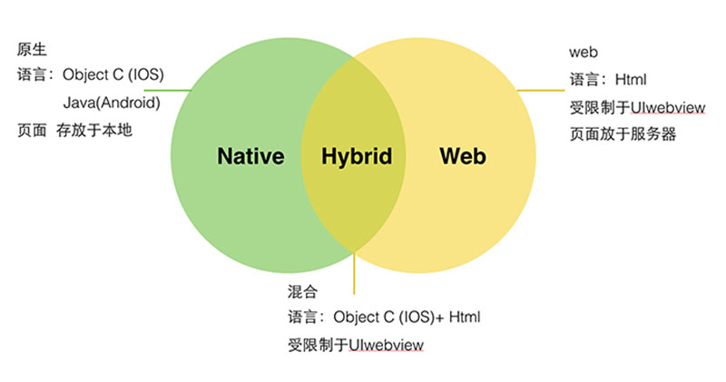
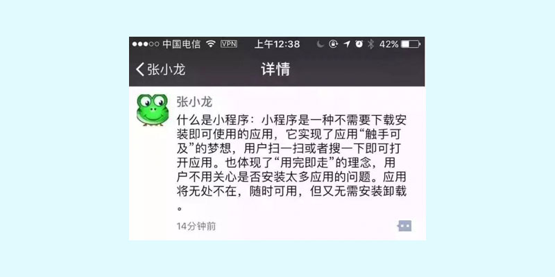
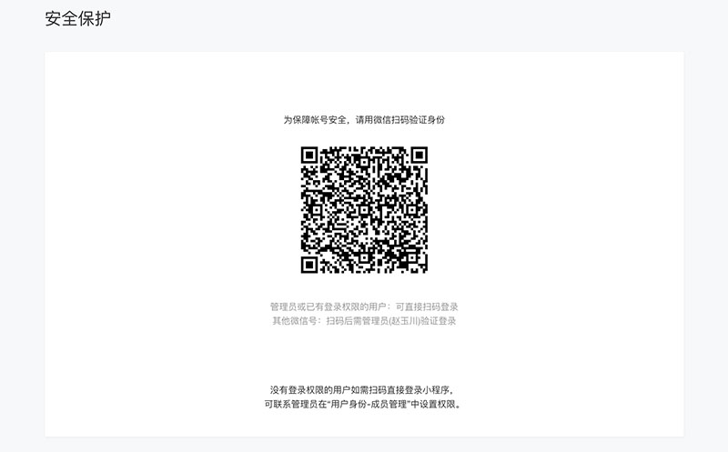

## 简介和体验

### 1. 概念

微信是一个生态圈，包括即时通信、移动支付、社交媒体、游戏娱乐等多个领域，彼此之间紧密联系、互为支撑形成了一个强大的微信帝国。日常交流中所提到的微信更多是指的**即时通信**和**移动支付**，而微信小程序属于微信生态中重要的组成部分。

> *注：除了有微信小程序外，支付宝、百度等也如法炮制了小程序，文中提到的小程序如无特别说明，特指微信小程序。*


移动开发技术层出不穷：

- H5（Web App）

  即运行于移动设备浏览器的**网页**，使用 html5、css3 等技术实现，可以跨平台。

- 原生应用（Native App）

  即所谓的 Android 和 IOS 开发，可以直接与底层操作系统通信，可扩展性非常强，不可跨平台。

- 混合应用（Hybrid App）

  混合了Web App 和 Native App开发技术，一般展示类内容使用 Web App技术，交互性较强的使用 Native App技术，可以跨平台。



> 小程序是一种新型的轻量的开发技术，"微信之父" 张晓龙是这样定义小程序的：



**`结论：`**小程序是基于 WEB 规范，采用 HTML、CSS 和 JS（WXML/WXSS/JavaScript）等搭建的一套框架，本质就是富单页面 web 应用。

### 2. 体验小程序

开发者可使用微信客户端(6.7.2 及以上版本)扫码下方小程序码，体验小程序。


[查看小程序示例源码](https://github.com/wechat-miniprogram/miniprogram-demo)

扩展阅读：[微信开发者文档](https://developers.weixin.qq.com/doc/)

## 开发小程序

### 小程序与 web 网页开发区别

小程序的主要开发语言是 JavaScript ，小程序的开发同普通的网页开发相比有很大的相似性。对于前端开发者而言，从网页开发迁移到小程序的开发成本并不高


网页：渲染线程和脚本线程是互斥的 => 脚本执行会阻塞渲染

小程序：渲染线程和脚本线程是两个独立的线程

说明：

1. 网页依赖浏览器
2. 小程序依赖**微信**=> ios/android 微信客户端=》跨平台（像 react-native ）

## 开发准备-账号申请

> 开发小程序的第一步，需要拥有一个小程序帐号，通过这个帐号就可以管理和开发属于自己的小程序。

### 1. 账号申请

注册地址：https://mp.weixin.qq.com/cgi-bin/registermidpage?action=index&lang=zh_CN

每个邮箱仅能申请一个小程序

### 2. 账号类型


### 3. 账号信息

> 注意⚠：填写邮箱要确保之前没有注册过微信公众平台其它账号的新邮箱（例如：公众号）


### 4. 邮箱激活

它会向我们绑定的邮箱发邮件


### 5. 信息登记和绑定管理员


注意：填写完个人信息，使用**自己的微信**扫码绑定小程序管理员


### 6. 登录小程序后台


说明：需要管理员授权（上一步注册中扫码绑定），**使用管理员微信扫码确认后即可登录到小程序后台**



## 小程序管理后台


### 获取AppID


### 成员管理


## 开发准备-小结

一个邮箱只能对应一个小程序。

每个小程序可以有多个不同类型的成员；自己申请的小程序，自己就是管理员。

每个小程序有自己唯一的 AppID。 


到企业工作开发小程序流程：

1. 获取公司小程序的 AppID  
2. 让管理员给你开通开发者权限

## 下载开发工具

### 下载

[下载](https://developers.weixin.qq.com/miniprogram/dev/devtools/download.html)IDE

说明：下载最新稳定版本即可


### 安装

双击安装即可

## 创建小程序项目

### 登录开发者工具

开发者工具安装后打开，**需要使用微信扫码登录**


### 创建小程序

1. 填写小程序项目名称
2. 选择项目代码保存目录（**`注意：`**选择后加上项目名称，这样代码会生成到该目录）
3. 填写 AppID （可以先使用测试号，后面随时可以修改）
4. 语言选择 javascript
5. 后端服务**不使用云服务**，最后确定


注意⚠️：选择小程序项目目录时，需要手动加上项目名称

## 开发者工具

### 开发者工具的基本使用

使用微信官方的开发者工具对小程序代码进行编辑，如下图：


说明：使用官方开发工具编辑小程序并不是唯一方式，开发者也可以根据自已喜好自由选择任意编辑工具，如 sublime_text、WebStorm、VS Code等。

## 预览小程序

使用绑定的开发者微信用户扫描二维码，便可以在微信中打开小程序了（并不是所有人都可以去扫码预览）


说明：由于小程序处于开发阶段，在小程序 **后台管理=>成员管理=>项目成员**，添加开发成员后，才可以描码在真机中预览小程序。

## 官方文档

[官方文档](https://developers.weixin.qq.com/miniprogram/dev/index.html?t=2018413)

## 小程序的项目结构

### 目录结构


```bash
├── pages    		    # 页面目录（默认生成2个页面：index 和 logs）
│   ├── index 			# index 页面目录
│   │   ├── index.js 	# index 页面业务逻辑
│   │   ├── index.wxml 	# index 页面布局结构
│   │   └── index.wxss 	# index 页面布局样式
│   └── logs 			# logs 页目录
│       ├── logs.js 	# logs 页面业务逻辑
│       ├── logs.json 	# logs 页面配置文件
│       ├── logs.wxml 	# logs 页面布局结构
│       └── logs.wxss 	# logs 页面布局样式
├── utils 			    # 全局方法
│       └── util.js 	# 工具方法
├── app.js 			    # 入口文件(程序入口)
├── app.json 			# 全局配置
├── app.wxss 			# 全局样式
├── project.config.json # 项目配置文件
└── sitemap.json 		# 配置小程序及其页面是否允许被微信索引
```

### app-入口

一个小程序主体部分由三个文件组成，必须放在项目的根目录，如下：

- app.js：小程序入口

- app.json：小程序全局配置
- app.wxss:：小程序全局(公共)样式，非必须

### pages-页面

一个小程序页面由四个文件组成，分别是：

1. 页面名字`.js` : 表示页面逻辑  ，必要

2. 页面名字`.wxml`： 表示页面布局结构  ，必要

   wxml 指的是 **W**ei **X**in **M**arkup **L**anguage，微信团队以 XML 为基础，而定义的一套用以实现小程序页面布局的标记语言，与HTML非常类似。

3. 页面名字`.wxss`：  表示页面布局样式，  非必须 

   wxss 指的是 **W**ei **X**in **S**tyle **S**heet，微信团队定义的一套用以实现小程序布局样式的层叠样式表，与CSS非常接近 

4. 页面名字`.json`：  表示页面局部配置， 非必须

### 小结

1. 小程序包含一个描述整体程序的 app 和多个描述各自页面的 pages
2. app.js 是小程序入口（.json 全局配置，.wxss 全局样式）
3. pages 目录中放小程序页面（一个页面包含4个部分）

## 配置 app.json

[官网文档](https://developers.weixin.qq.com/miniprogram/dev/reference/configuration/app.html)

### 全局配置

通过 [app.json](https://developers.weixin.qq.com/miniprogram/dev/reference/configuration/app.html) 文件对小程序进行全局配置，如页面文件的路径、窗口表现、设置网络超时时间、设置 tab 标签页等。

配置清单：

| 属性   | 类型   | 必填 | 描述             |
| ------ | ------ | ---- | ---------------- |
| pages  | Array  | 是   | 设置页面路径     |
| window | Object | 否   | 设置默认窗口表现 |
| tabBar | Object | 否   | 设置底部标签栏   |

### app.json 示例

```json
{
  "pages":[
    "pages/index/index",
    "pages/detail/index"
  ],
  "window":{
    "backgroundTextStyle":"light",
    "navigationBarBackgroundColor": "#fff",
    "navigationBarTitleText": "WeChat",
    "navigationBarTextStyle":"black"
  }
}
```

### pages

* 数组类型，数组中每一项都是字符串，来指定小程序由哪些页面组成。
* 每一项代表对应页面的【路径+文件名】信息，数组的**第一项代表小程序的默认首页--打开小程序后看到的第一个页面**。文件名不需要写文件后缀，因为框架会自动去寻找路径下 .json ,  .js,  .wxml ,  .wxss 四个文件进行整合。
* 小程序中新增/减少页面，都需要对 pages 数组进行修改。

```js
// 创建目录及文件
// 习惯性的将页面统一放到名叫 pages 的目录中，不是强制要求，可以起任意名称的目录
pages
├── detail
│   ├── index.js
│   └── index.wxml
└── index
    ├── index.js
    └── index.wxml
```


## 配置-window

### window项配置

在 app.json 中，window 项用于设置**全局小程序**的状态栏、导航条、标题、窗口背景色。(查看window [更多配置](https://developers.weixin.qq.com/miniprogram/dev/framework/config.html#window)属性)

| 属性                         | 类型     | 默认值  | 描述                               |
| ---------------------------- | -------- | ------- | ---------------------------------- |
| navigationBarBackgroundColor | HexColor | #000000 | 导航栏背景颜色，如"#000000"        |
| navigationBarTextStyle       | String   | white   | 导航栏标题颜色，仅支持 black/white |
| navigationBarTitleText       | String   |         | 导航栏标题文字内容                 |

图示


## 配置-tabBar

### 目标

掌握小程序tab菜单配置

[tabBar](https://developers.weixin.qq.com/miniprogram/dev/reference/configuration/app.html#tabBar)

```js
// 示例配置
  "tabBar": {
    "color": "#000",  // tab 上的文字默认颜色
    "selectedColor": "#fff", // tab 上的文字选中时的颜色
    "backgroundColor": "#fd1688",
    "position": "bottom",
    "list": [
      {
      	"pagePath": "pages/index/index",
      	"text": "首页"
      },
      {
        "pagePath": "pages/logs/logs",
        "text": "日志"
      }
    ]
  }
```

1. **对象类型**，配置项指定 tab 栏的表现，以及 tab 切换时显示的对应页面。

| 属性            | 类型     | 必填 | 默认值 | 描述                                    |
| --------------- | -------- | ---- | ------ | --------------------------------------- |
| color           | HexColor | 是   |        | tab 上的文字默认颜色                    |
| selectedColor   | HexColor | 是   |        | tab 上的文字选中时的颜色                |
| backgroundColor | HexColor | 是   |        | tab 的背景色                            |
| borderStyle     | String   | 否   | black  | tabbar上边框的颜色， 仅支持 black/white |
| list            | Array    | 是   |        | tab 的列表，最少2个、最多5个            |
| position        | String   | 否   | bottom | 可选值 bottom、top                      |

* 当设置 position 为 top 时，将不会显示 icon
* tabBar 中的 list 是一个数组，**配置项最少2个、最多5个 tab**，tab 按数组的顺序排序。

2. **list** 接受一个数组，数组中的每个项都是一个对象，其属性值如下：

| 属性             | 类型   | 必填 | 描述                                                         |
| ---------------- | ------ | ---- | ------------------------------------------------------------ |
| pagePath         | String | 是   | 页面路径，必须在 pages 中先定义                              |
| text             | String | 是   | tab 上按钮文字                                               |
| iconPath         | String | 否   | 图片路径，icon 大小限制为40kb，建议尺寸为 81px * 81px，当 postion 为 top 时，此参数无效，不支持网络图片 |
| selectedIconPath | String | 否   | 选中时的图片路径，icon 大小限制为40kb，建议尺寸为 81px * 81px ，当 postion 为 top 时，此参数无效 |


## 配置-pages

### 配置首页

通过全局配置或者编译模式控制小程序默认首页

方式：

1. 数组中第一项，为默认首页

2. 添加不同的编译模式，去指定默认首页（特别说明：只在开发测试时使用，上线就不能生效了）


### 页面局部配置

每个页面可以有不同的表现，通过 pages 目录下的 .json 文件，如 logs.json ，实现页面的局部配置。但是**只能设置 window 配置项的内容**，页面中配置项会覆盖 app.json 的 window 中相同的配置项。

| 属性                         | 类型     | 默认值 | 描述                               |
| ---------------------------- | -------- | ------ | ---------------------------------- |
| navigationBarBackgroundColor | HexColor | #000   | 导航栏背景颜色                     |
| navigationBarTextStyle       | String   | white  | 导航栏标题颜色，仅支持 black/white |
| navigationBarTitleText       | String   |        | 导航栏标题文字内容                 |


## 页面的结构和样式


### 页面

- 小程序的每一个页面都是由 .wxml、.wxss、.js 三部分构成，**并且要求文件名一致**
- 通常为了**管理方便**，会将小程序的每个页面单独归到同一个目录下，所有的页面又都归到了 pages 目录下。
- 小程序与 Web 类似，也分为结构、表现、行为三部分。
  - 使用标记语言 WXML 定义结构
  - 使用 WXSS 定义表现
  - 使用 JavaScript 定义行为。

### WXML-页面

* wxml 指的是 **W**ei **X**in **M**arkup **L**anguage，微信团队以 XML 为基础，定义的一套用以实现小程序页面布局的标记语言，与HTML非常类似。

* wxml 有一套**自已的标签**（**基础组件**）如 form、input、textarea、button、audio、video、view、text 等，其含义与 html 的标签也是一样的。wxml 中的 **view、text** 可分别与 html 中的 div、span 对应。

```html
<form>
  <view class="items">
    <view>
      <label for="">姓名:</label>
      <input type="text" placeholder="请填写您的真实姓名" />
    </view>
    <view>
      <label for="">手机:</label>
      <input type="text" placeholder="请填写您的手机号" />
    </view>
    <view>
      <label for="">身份:</label>
      <input type="text" placeholder="请选择您与宝宝的关系身份" />
    </view>
    <view>
      <label for="">验证码:</label>
      <input type="text" placeholder="六位数字验证码" />
      <button class="verify" size="mini">获取验证码</button>
    </view>
  </view>
  <button class="submit">绑定并登录</button>
</form>
```

扩展阅读：[组件文档](https://developers.weixin.qq.com/miniprogram/dev/component)

### WXSS-样式

* wxss 指的是 **W**ei **X**in **S**tyle **S**heet，微信团队定义的一套用以实现小程序布局样式的层叠样式表，与CSS非常接近。可以理解成 wxss 是 css 的一个子集，也包括选择器、属性、值部分，同样具有层叠的特征。

* 小程序会自动根据 wxml 文件名，自动将 wxss 进行加载，例如：当加载 pages/style/**index**.wxml 时，会自动将 pages/style/**index**.wxss 加载。

```css
/* 样式仅供参考 */
page {
    background: #F0F0F0;
}

.items {
    padding-left: 15px;
    background: #FFF;
}

.items view {
    display: flex;
    padding: 10px 15px 10px 0;
    color: #3C3C3C;
    font-size: 14px;
    border-bottom: 1px solid #F0F0F0;
}

.items view:last-child {
    border-bottom: 0 none;
}
```

### **`小结`** 

1. **view、text** 可分别与 html 中的 div、span 对应，小程序**常用布局元素**
2. css 编写方式、语法和 web 类似
   1. 小程序会自动引入样式

## 页面屏幕适配


### 为什么要适配

移动设备种类较多，如操作系统有 Android、IOS、Windows Phone等，屏幕尺寸有 4寸、4.7寸、5.5寸等

### 常用适配方案

**rem**

1. rem 是一个相对单位

2. 换算关系：rem 大小是相对于 html 根字体大小

   例子：html 的 font-size: 32px => 1rem = 32px

**vw/vh**

1. vw/vh 也是一个相对单位
2. 换算关系：根据视窗( Viewport )大小来决定的（1vw/vh 代表视窗的宽度/高度为 1%）

### 小程序适配

rpx（responsive pixel）可以根据屏幕宽度进行自适应。是小程序专有的单位，它规定所有屏幕宽均为 750rpx。

* 操作系统的差异。**小程序运行在微信中**，微信有 Android版本 和 IOS版本，天然可以实现跨平台（操作系统）运行。
* 任何尺寸。为了保证小程序能够在任何尺寸的屏幕上都能正常显示，微信提供了一个新的尺寸单位 **rpx** **，rpx 是一个相对长度单位，会根据屏幕尺寸自动调整**（有点类似百分比的意思）。
  * 750rpx  === 100%屏幕宽度

### rpx 与 px 的换算关系

| 设备           | 屏幕尺寸  | rpx换算px (屏幕宽度/750) | px换算rpx (750/屏幕宽度) |
| -------------- | --------- | ------------------------ | ------------------------ |
| iPhone5        | 320px     | 1rpx = 0.42px            | 1px = 2.34rpx            |
| 小米MIX 2S     | 360px     | 1rpx = 0.48px            | 1px = 2.083rpx           |
| iPhone6        | **375px** | 1rpx = **0.5px**         | 1px = 2rpx               |
| iPhone6 Plus   | 414px     | 1rpx = 0.552px           | 1px = 1.81rpx            |
| HUAWEI Mate 10 | 480px     | 1rpx = 0.64px            | 1px = 1.562rpx           |

说明：上述表格展示了 rpx 与 px 的换算关系，但是由微信小程序在执行过程中自动换算的，我们只**需要了解换算关系**就可以了。

### 总结

1. 开发小程序时所有屏幕宽度都是 750rpx
2. 开发微信小程序时设计师可以用 **750px (1:1)作为视觉稿的标准**，这样可以一定程序上避免换算带来的误差。
3. rpx 原理和 rem 适配类似：大屏幕 1rem 对应的 px 值大，相反则小

## 页面小结

页面构成：.js, .wxml, .wxss, .json

创建新页面：添加文件夹，右键-> 新建 page (它会自动在app.json中补充pages)

访问新页面：在tabBar中，添加配置，设置导航栏，以跳转页面

## 案例-游乐园-配置


> 设计高保真参考文件


开发流程：

###  新建项目


### 配置window

编辑 app.json，添加字段 windows

```json
"window": {
    "navigationBarBackgroundColor": "#fff",
    "navigationBarTitleText": "游乐园",
    "navigationBarTextStyle": "black"
},
```

颜色值从设计稿中获取

### 配置 tabbar

图标文件：`02-其它资源/游乐园/icons`，复制到项目下

#### 新建 tabbar 页面

**使用**微信开发者**工具快速创建页面**（可以删除默认创建的页面）

1. 首页在 pages 目录下创建页面的文件夹


2. 在新创建的目录下=》选择新建 Page =〉自动生成.js、.json、.wxml、.wxss四个文件


#### 配置 tabBar 页面

```json
  "tabBar": {
    "color": "#333",
    "selectedColor": "#FFC64B",
    "backgroundColor": "#FFF",
    "borderStyle": "black",
    "list": [
      {
        "text": "首页",
        "pagePath": "pages/home/home",
        "iconPath": "icons/home.png",
        "selectedIconPath": "icons/home-active.png"
      },
      {
        "text": "卡券",
        "pagePath": "pages/card/card",
        "iconPath": "icons/card.png",
        "selectedIconPath": "icons/card-active.png"
      },
      {
        "text": "我的",
        "pagePath": "pages/my/my",
        "iconPath": "icons/my.png",
        "selectedIconPath": "icons/my-active.png"
      }
    ]
  },
```

### 最终效果


### 总结

1. tabBar 在页面A中自动生效的提前是：页面 A 在 tabBar 中的 list 列表中定义了
2. 创建项目注意填写自己的 appid
3. 掌握 window 和 tabba r配置

## 案例-游乐园-首页

**`本节目标：`**根据设计稿实现首页布局效果

预览效果：


### 轮播图布局

**`本节目标：`**使用微信提供的基础组件，实现简单轮播图效果

准备：静态资源使用`02-其它资源/游乐园/static`目录中图片，拷贝到项目下

结构：

```jsx
<swiper
  class="slider"   
  indicator-dots
  autoplay
  circular
  interval="2000"
  indicator-color="rgba(255,255,255,.6)"
  indicator-active-color="#fff"
  >
    <swiper-item>
      <image src="../../static/slider.png"></image>
    </swiper-item>
    <swiper-item>
      <image src="../../static/slider.png"></image>
    </swiper-item>
    <swiper-item>
      <image src="../../static/slider.png"></image>
    </swiper-item>
  </swiper>
```

注意：

1. 图片路径只能使用相对路径或者url连接(https://meng-imgs.oss-cn-beijing.aliyuncs.com/slider.png)

2. 备用地址：https://yjy-teach-oss.oss-cn-beijing.aliyuncs.com/miniapp/slider.png

### 样式

```css
/* pages/home/home.wxss */
page {
  background: #f0f0f0;
}
.slider ,.slider image {
  width:750rpx;
  height: 320rpx
}
```

### 小结

扩展阅读：[轮播图组件](https://developers.weixin.qq.com/miniprogram/dev/component/swiper.html)

## 案例-游乐园-首页-栏目布局


### 标签

view、 text、 navigator、 image

### 结构

```jsx
  <!-- 活动专题 -->
<view class="party">
  <view class="title">
    <text>乐园活动</text>
  </view>
  <view class="item">
    <!-- 图片 -->
    <view class="img">
      <text>进行中</text>
      <image src="https://meng-imgs.oss-cn-beijing.aliyuncs.com/list.png"></image>
    </view>
    <!-- 描述 -->
    <view class="info">
      <view class="tit">
       疯狂的红包 不一样的撕名牌 大型家庭亲子户外活动 速度来参加
      </view>
      <view class="btn">
      免费
      </view>
      <view class="extra">
        <text><text class="icon-flag"></text>200人已报名</text>
        <text><text class="icon-clock"/>本周六开始</text>
      </view>
    </view>
    <!-- info end -->
  </view>
</view>
```

### 样式

```css
.party .title {
  font-size: 32rpx;
  font-weight: bold;
  padding: 28rpx 34rpx;
}

.item .img {
  position: relative;
}

.item image {
  width: 750rpx;
  height: 320rpx;
}

.item .img text {
  width: 136rpx;
  height: 58rpx;
  line-height: 50rpx;
  text-align: center;
  background: url(https://meng-imgs.oss-cn-beijing.aliyuncs.com/going.png);
  background-size: cover;
  color: #FFF;
  position: absolute;
  left: 30rpx;
  top: -10rpx;
  font-size: 24rpx;
}

.info {
  padding: 30rpx 34rpx;
  background: #fff;
}

.info .tit {
  font-size: 30rpx;
}

.info .btn {
  margin-top:16rpx;
  width: 86rpx;
  height: 42rpx;
  line-height: 42rpx;
  background: #ffc64b;
  border-radius: 4rpx;
  font-size: 24rpx;
  font-weight: 400;
  text-align: center;
  color: #ffffff;
}

.extra {
  margin-top: 32rpx;
  padding-bottom: 30rpx;
  color: #B4B4B4;
  font-size: 24rpx
}

.extra>text:first-child {
  margin-right: 20rpx;
}

.extra text[class^="icon-"] {
  margin-right: 10rpx;
}
```

### 注意

wxss 中不能读取本地图片、字体等资源 ----> 只能使用 url 连接网络资源

1. 当在 wxss 中引入本地资源（图片、字体）时，也会报错，原因是小程序中 wxss 不支持本地资源路径，只支持网络路径(http:// 或 https://)或者 base64 路径。
1. 然而在 app.json 中配置 tabBar 时所设置的图标只支持本地资源路径


## 字体图标

> 在小程序中可以像网页一样使用字体图标，并且使用方式基本一致。唯一的不同在于小程序中字体图标所引入的字体文件路径为网络路径，且**必须为 https 协议**。

全局样式 app.wxss 中加入，字体图标代码：

```css
@font-face {
  font-family: 'icomoon';
  src:  url('https://static.botue.com/paradise/fonts/icomoon.eot?lzaqut');
  src:  url('https://static.botue.com/paradise/fonts/icomoon.eot?lzaqut#iefix') format('embedded-opentype'),
  url('https://static.botue.com/paradise/fonts/icomoon.ttf?lzaqut') format('truetype'),
  url('https://static.botue.com/paradise/fonts/icomoon.woff?lzaqut') format('woff'),
  url('https://static.botue.com/paradise/fonts/icomoon.svg?lzaqut#icomoon') format('svg');
  font-weight: normal;
  font-style: normal;
}

[class^="icon-"], [class*=" icon-"] {
  /* use !important to prevent issues with browser extensions that change fonts */
  font-family: 'icomoon' !important;
  font-style: normal;
  font-weight: normal;
  font-variant: normal;
  text-transform: none;
  line-height: 1;

  /* Better Font Rendering =========== */
  -webkit-font-smoothing: antialiased;
  -moz-osx-font-smoothing: grayscale;
}
.icon-clock:before {
  content: "\e902";
}

.icon-flag:before {
  content: "\f11d";
}

```


加载字体图时，会出现上图所示的[错误提示](https://developers.weixin.qq.com/miniprogram/dev/api/ui/font/wx.loadFontFace.html)，忽略即可！


## 页面跳转

### 语法格式

使用 navigator 组件导航路由

语法：`  <navigator open-type="navigate" url="/pages/pops/pops">跳转</navigator>`

1. 普通页面跳转

```html
<navigator url="/pages/pops/pops">go</navigator>
```

2. tabbar 页面跳转

```html
<navigator open-type="switchTab" url="/pages/home/home">go</navigator>
```

3. 替换当前，然后打开新页面 => 不能返回上次浏览页面

```html
<navigator open-type="redirect" url="/pages/news/news">go</navigator>
```

### 示例

给栏目图片加上导航

    <view class="img">
      <text>进行中</text>
      <navigator hover-class="none" open-type="switchTab" url="/pages/profile/index">
        <image src="https://meng-imgs.oss-cn-beijing.aliyuncs.com/list.png"></image>
      </navigator>
    </view>

## 发布预览


### 预览问题

完成了小程序的首页面，如果通过开发工具=> 预览 => 扫码，会遇到一个**错误提示**，如图所示：


错误的原因是微信官方要求小程序**主体代码包**体积不允许超过 2M，其中图片资源占用了较大部分空间，然而实际项目中图片资源都是通过服务器返回，而非本地资源，所以 2M 的大小可以满足大部分的需求。

### 解决		

通过配置  [project.config.json](https://developers.weixin.qq.com/miniprogram/dev/devtools/projectconfig.html) 文件，可以忽略某些文件（如图片等）以减少预览发布资源所占空间的大小。

```json
"packOptions": {
  "ignore": [
    {
      "type": "folder",
      "value": "static"
    }
  ]
}
```

### 总结

1. 发布主代码包大小不能超过2M