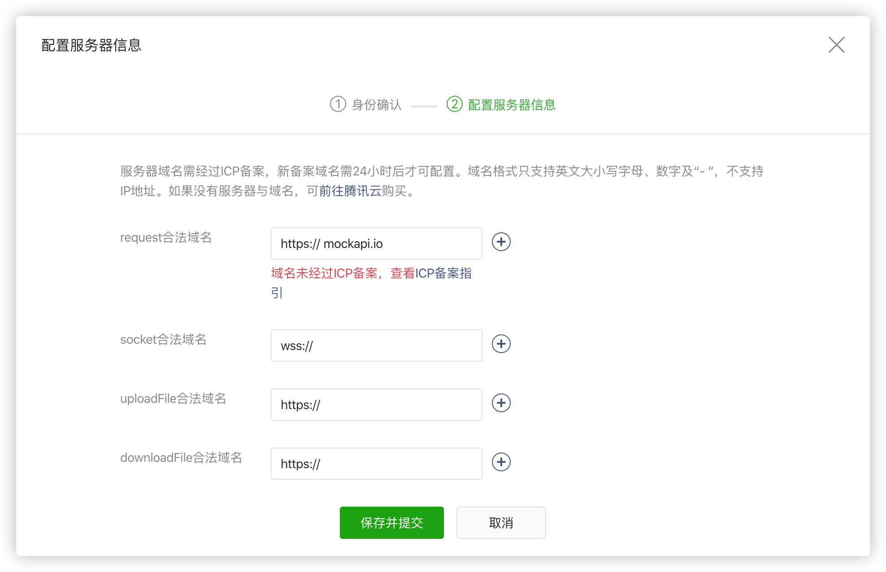

## 数据定义与绑定

### 定义数据

使用 Page() 方法，声明 data 数据对象，类似于 vue 中定义数据的方法。

```js
// Page 是全局提供的，用来创建一个页面实例
Page({
	// 通过 data 属性，初始化页面中用到的数据
	data: {
 	  // 字符串类型
  	  message: 'hello world!',
      user: {
      	name: '小明',
        age: 16
   	  },
      courses: ['wxml', 'wxss', 'javascript']
	}
});
```

### 使用数据

在 wxml 中，使用 Mustache 语法（双大括号）将数据变量包起来

   ```html
<text>{{message}}</text>
<text>我叫{{user.name}}，我今年{{user.age}}岁了，我在学习{{courses[0]}}课程。</text>
   ```


## 属性绑定

可以使用 Mustache 语法设置元素属性值，如常见的 class 类名、a 标签的 url 链接等

```js
data: {
    addClass: true,
    url:'/pages/meng/index',
  }
```

```html
<view class="{{addClass?'className1':'className2'}}">
	<text>动态class</text>
  <navigator url="{{url}}">go</navigator>
</view>  

```


## 插值表达式

使用 Mustache 语法除了取值以外，还可以写表达式，如常见的三元表达式、加减乘除运算等

```html
<text>{{flag ? '是': '否'}}</text>
<text>{{ 1*5 }}</text>
```


## 简单列表渲染

> 通过 wx:for 控制（类似 vue 中的指令 v-for）生成多个元素。

使用 wx:for渲染列表数据 , 内置的 index 变量可以访问数组索引，item 变量访问单元值。

循环渲染必须带 key 值，该值是唯一不可重复的，不能动态改变

```js
Page({
  // 通过 data 属性，初始化页面中用到的数据
  data: {
    users: [
      {id:1, name: '小明', age: 16, gender: '男'},
      {id:2, name: '小刚', age: 19, gender: '男'},
      {id:3, name: '小红', age: 18, gender: '女'},
      {id:4, name: '小丽', age: 17, gender: '女'}
    ]
  }
});
```

```html
<view wx:for="{{users}}" wx:key="id">
  <text>{{index+1}}</text>
  <text>{{item.name}}</text>
  <text>{{item.age}}</text>
  <text>{{item.gender}}</text>
</view>
```

**注意**：一定要写双括号，且双括号和引号之间没有空格，否则会被解析成字符串，循环不生效


## 复杂列表渲染

通过 wx:for 对数组数据进行遍历时，可以分别指定访问数组索引值变量和单元值的变量。

- wx:for-index 指定索引值变量，wx:for-item 指定单元值变量。

```js
data: {
    brands: [
      {
        name: '耐克',
        origin: '美国',
        category: ['男装', '女装', '鞋', '体育用品']
      },
      {
        name: 'SK-II',
        origin: '韩国',
        category: ['防晒霜','面膜', '洗护']
      }
    ]
  }
```

```html
<view wx:for="{{brands}}" wx:for-index="k" wx:for-item="v" wx:key='k' >
  <view>
    <text>{{k+1}} </text>
    <text> {{v.name}} </text>
    <text> {{v.origin}}</text>
  </view>
  <view>
    <text wx:for="{{v.category}}">{{item}}</text>
  </view>
</view>
```


## 条件渲染

根据条件可以控制是否渲染某个（些）元素，语法：`wx:if="{{布尔值}}"`

```html
<view wx:if="{{true}}">
  <text>看不到我？</text>
</view>

<view wx:for="{{users}}" wx:key='index'>
  <text>{{index+1}} </text>
  <text> {{item.name}}</text>
  <text wx:if="{{item.age <= 14}}"> 儿童</text>
  <text wx:elif="{{item.age < 18}}"> 未成年</text>
  <text wx:else> 成年人</text>
</view>
```


## 事件

小程序中的事件同网页 DOM 中的事件含义类似，只是语法及及其执行细节上略有差异。

语法：`<组件 bind:事件名="函数"></组件> `或 `<组件 bind事件名="函数"></组件>`  

常用的事件如 tap、input、change、focus、blur 等

```html
<!-- 为 button 组件绑定 tap 事件，相当于 html 中的 click 事件，会执行 sayHi 函数 -->
<button type="primary" bind:tap="sayHi">点我试试</button>
<input type="text" bind:focus="sayHi" bind:blur="sayBye" />
```

```js
Page({
  // 事件回调函数，位置和 data 平级，e 即为事件对象，为回调函数第一个参数
  sayHi(e) {
    console.log('Hi~',e)
  }
})
```

此外还支持单独的 WXS 文件来绑定事件，[详见官网](https://developers.weixin.qq.com/miniprogram/dev/framework/view/wxml/event.html)

```html
<wxs module="wxs" src="./test.wxs"></wxs>
<view id="tapTest" data-hi="Weixin" bindtap="{{wxs.tapName}}"> Click me! </view>
<!-- 注意：绑定的 WXS 函数必须用{{}}括起来 -->
```

```js
// wxs 文件实现 tapName 函数
function tapName(event, ownerInstance) {
  console.log('tap Weixin', JSON.stringify(event))
}
module.exports = {
  tapName: tapName
}
```


## 事件对象传参

当某个事件被触发时，通过一个对象可以获得被触发事件的相关信息。回调函数的第一个参数即为事件对象。

注意：

* 小程序中**不支持**事件回调函数在**模版中传递参数**
* 获取元素 data-params 自定义属性值=>推荐使用 event 对象的 **target 去获取对应触发元素自定义属性的值**

说明：**event.target** 获取触发事件的元素属性，例如自定义属性

```javascript
Page({
  // 事件回调函数
  sayHi: function (ev) {
    // ev 即为事件对象，包含了事件相关信息
    // 着重关注 ev.target.dataset 它可以获得 wxml 组件中以 data- 开头的自定义属性
    // target： 触发该事件的源头组件，而currentTarget则是当前事件所绑定的组件
    console.log(ev.target.dataset);
  }
});
```

```html
<view class="child" data-name="小明" data-age="16" bind:tap="sayHi">点我试试</view>
```


## 事件冒泡

事件分为冒泡事件和非冒泡事件：

1. 冒泡事件：当一个组件上的事件被触发后，该事件会向父节点传递。
2. 非冒泡事件：当一个组件上的事件被触发后，该事件不会向父节点传递。

除 `bind` 外，也可以用 `catch` 来绑定事件。与 `bind` 不同， `catch` 会阻止事件向上冒泡。

```html
<!-- 此处点击子盒子，父盒子的事件不会被触发了 -->
<view class="parent" bind:tap="foo">
  <view class="child" catch:tap="bar"></view>
</view>
```


## 数据更新

通过核心 API: Page.prototype.setData(data:object, callback:function) 来实现数据驱动视图，直接修改 data 中的数据，**无法触发视图刷新**，还会造成数据不一致

注意：

* 第一个参数传入data变量中变量名和新值：{变量名 : 新值 }

* 其中 **变量名** 可以以数据路径的形式给出，支持改变数组中的某一项或对象的某个属性，如 `array[2].message`，`a.b.c.d`。

```
 <button bindtap="changeArr">修改数组</button>
```

```js
Page({
  data:{
   	msg: 'hello wx!',
    list: [{ id: 1, name: 'html' }, { id: 2, name: 'css' }],
  },
  // 修改数组
  changeArr() {
// this.setData({data中的属性名: 新值},()=>{ setData 界面更新渲染完毕后的回调函数 })
    this.setData({
      'list[3].name': 'python'
    },()=>{
      console.log(this.data.list)
    })
  }
})
```


## 生命周期

小程序是按着某种特定的流程序执行的，并且允许开发人员对执行过程中的若干节点进行事件监听，通常将这些节点称为生命周期，如小程序启动、销毁等。

小程序中将生命周期分成两类：

1. **应用级别**： 在 App() 中触发
2. **页面级别**： Page() 中触发

**应用级别**：在 app.js 文件中调用 App() 函数，**应用级别**的生命周期在这里进行监听。

```js
// App 函数是小程序内置提供的，接受一个对象类型的数据做为参数。
// 注意大小写
App({
  
  // 小程序启动时
  onLaunch: function () {
    // 全局只会触发1次
    console.log('小程序启动了...');
  },
  // 小程序前台运行时
  onShow: function () {
    // 重复执行
    console.log('小程序前台运行了...');
  },
  // 小程序后台运行时
  onHide: function () {
    // 重复执行
    console.log('小程序后台运行了...');
  },
  // 执行错误时
  onError: function (err) {
    console.log('出错啦!!!');
  },
  // 冷启动（如扫码）打开小程序的页面不存在时
  onPageNotFound: function () {
    console.log('你找到页面去火星了？？？');
  }
})
```

注意：		

* 点击小程序右上角的胶囊的关闭时，并不会将小程序销毁而是处于**后台运行**的状态，当再次打开小程序时并不会触发 onLaunch 生命周期的监听，而是触发 onShow 将小程序重新**前台运行**。

* 关于前台和后台的理解可以简单的理解成**最小化**了，桌面上暂时看不到，但程序依然在运行，常见的如按了 home 键、接听电话等都会将小程序置于后台运行。

* 小程序销毁是由微信自动控制，一般情况下小程序后台运行超过一定时间或者系统内存不足报警时，微信会主动将小程序销毁，当再次从小程序列表找到这个小程序打开时，会再次触发 onLaunch 这个生命周期。

扩展阅读：[运行机制](https://developers.weixin.qq.com/miniprogram/dev/framework/runtime/operating-mechanism.html)


**页面级别**：在页面对应的 .js 文件中调用 Page() 函数，页面级别的生命周期在这里进行监听。

```js
Page({
  // 页面加载时 vue=>created
  onLoad: function () {
    // 只会触发1次
    console.log('当前页面被加载了...');
  },
  
  // 页面显示时（返回、tabBar切换、前台运行）
  onShow: function () {
    // 重复触发
    console.log('当前页面显示了...');
  },
  // vue=> mounted
  onReady: function () {
    // 只会触发1次
    console.log('当前页面初次渲染完毕了...');
  },
  
  // 页面隐藏时（跳转、tabBar切换、后台运行）
  onHide: function () {
    console.log('当前页面不见了...');
  }
})
```

注意：

onShow 和 onHide 分别表示当前页面是否被显示/隐藏在当前小程序窗口，这其中包括几种情形：

1. 页面跳转 => onHide
2. 返回         => onShow
3. tabBar    => onShow 或 onHide
4. 前台        => onShow
5. 后台       => onHide


## 场景值

打开小程序的方式多种多样，如扫码、转发、搜索、公众号等，通过[场景值](https://developers.weixin.qq.com/miniprogram/dev/reference/scene-list.html)可以区分用户是以何种方式打开的小程序，通常用于条件判断或者数据统计等。

在小程序生命周期=>App()函数 onLaunch 和 onShow 中可以获得场景值

```js
App({
  onLaunch: function (res) {
    // 根据打开小程序的方式不同，res.scene 的值也不一样
    console.log(res.scene);
  },
  onShow: function (res) {
    // 这里也可以获取场景值
    console.log(res.scene);
  }
})
```


## 页面跳转

为小程序组件 navigator 指定 url 属性，可以实现页面间的跳转。

在跳转的同时支持通过 ? 向跳转页面传递参数。这一传参称为 query 传参

```html
<navigator url="/pages/demo/index?参数1=值1&参数2=值2">跳转页面</navigator>
```

```js
Page({
  // 在被跳转的页面中通过监听 onLoad 生命周期获得地址中的参数
  onLoad: function (query) {
    // 获取地址中的参数
    console.log(query);
  }
})
```


## 网络请求

小程序中由于宿主环境是微信，故所有请求均需通过微信来发送。官方提供了 `wx.request(config:object)` 语法发起网络请求

[测试接口](https://www.fastmock.site/mock/37d3b9f13a48d528a9339fbed1b81bd5/book/api/todos)

```js
Page({
    /**
   * 生命周期函数：vue => created
   */
  onLoad: function () {
    // 不支持 promise ，通过回调 success 函数来获取成功的数据
    wx.request({
      url:                                                   'https://www.fastmock.site/mock/37d3b9f13a48d528a9339fbed1b81bd5/book/api/todosr',
      success(res) {
       console.log(res)
      }
    })
  }
})
```

**注意**：发送请求有可能会报 `非法的请求域名` 错误，这是因为微信对此做了限制。uri 必须是 https + 备案，且必须在后台管理系统中添加进来

**解决办法：**

1. 通过添加合法域名：满足 => 支持**https协议**和**已经备案**

* 打开小程序管理后台 => 开发 => 开发设置


- 在 => 服务器域名 => 点击开始配置



2. 在开发者工具=》详情=〉本地设置，关闭校验。这适用于开发测试阶段


## 常用 API

API 是小程序开发的核心，通过 API 开发者可以获得微信底层封装的高级特性，如网络请求、设备信息、本地存储等。

小程序的 API 以全局对象 **wx** 为命名空间，**格式为 wx.方法名()**，可全局调用。

扩展阅读：[api文档](https://developers.weixin.qq.com/miniprogram/dev/api/)（查阅）


### 页面交互

1. wx.showToast 提示框
2. wx.showModal 确认框
3. wx.showTabBar 显示 tabBar
4. wx.hideTabBar 隐藏 tabBar

```js
wx.showToast({
  title: '成功',
  icon: 'success', // icon 为 none 时，会显示简单的文本提示
  duration: 2000
})
```


### 页面跳转

1. wx.navigateTo(Object object)

   ​	保留当前页面，跳转到应用内的某个页面。但是不能跳到 tabbar 页面。使用 [wx.navigateBack](https://developers.weixin.qq.com/miniprogram/dev/api/route/wx.navigateBack.html) 可以返回到原页面。

2. wx.switchTab(Object object)

   跳转到 tabBar 页面，并关闭其他所有非 tabBar 页面

3. wx.redirectTo(Object object)

   关闭当前页面，跳转到应用内的某个页面。但是不允许跳转到 tabbar 页面。

```
wx.navigateTo({
    url: '/pages/logs/logs'
})
```


### 数据缓存 

* wx.setStorage(Object object) ：存储 => 如果存储复杂类型，不需要序列化字符串直接存
* wx.getStorage(Object object) ：获取
* wx.removeStorage(Object object)： 删除

注意⚠️：

1. 单个 key 允许存储的最大数据长度为 1MB，所有数据存储上限为 10MB。
2. 除非用户主动删除或因存储空间原因被系统清理，否则数据都一直可用
3. 支持 Promise

```js
wx.setStorage({
  key:"key",
  data:"value"
}) 
// localStorage.setItem('xxx', 值)
```


### 获取个人信息

通过 `open-data` 组件可以用于展示微信开放的数据。该方法在最新版本中已失效，推荐使用

`wx.getUserProfile(Object object)` API，`desc `为必带属性，用于声明获取用户个人信息后的用途

```html
<open-data type="userAvatarUrl" />
<open-data type="userNickName" />
```

```js
 wx.getUserProfile({
      desc: '用于完善会员资料', // 声明获取用户个人信息后的用途，后续会展示在弹窗中
      success: (res) => {
        console.log(res)
      }
  })
```

