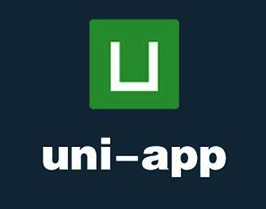
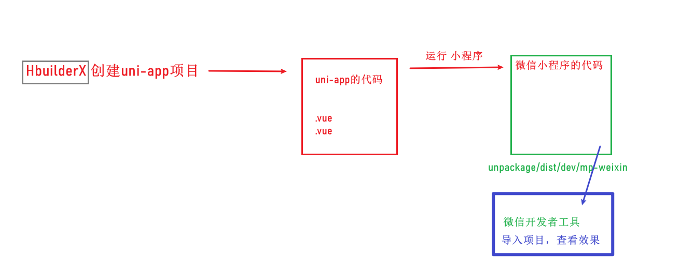
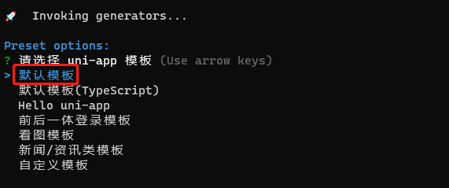
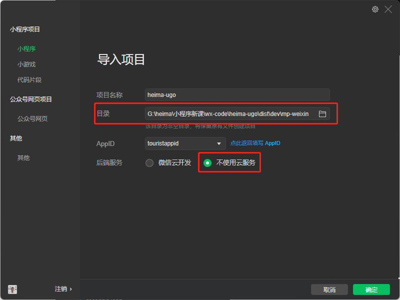
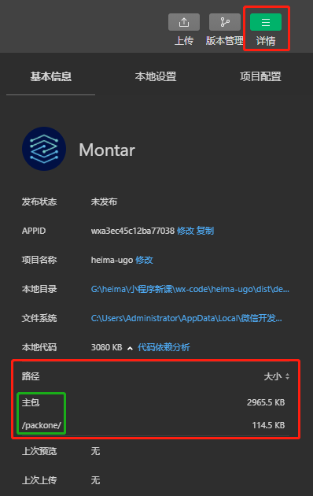
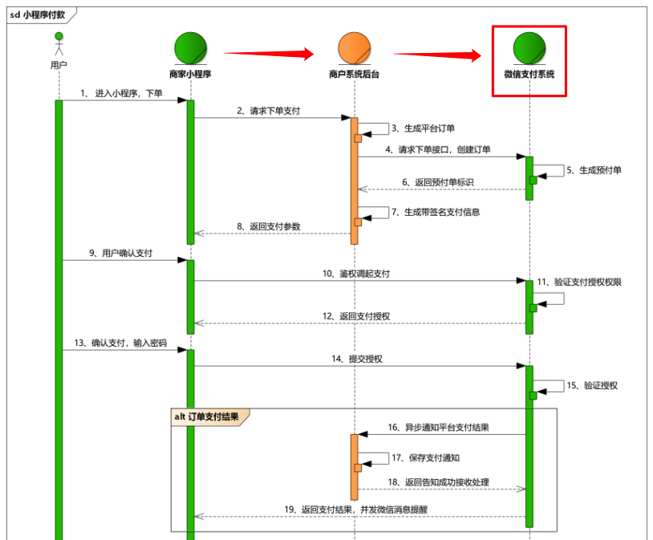
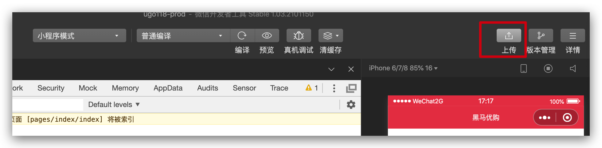
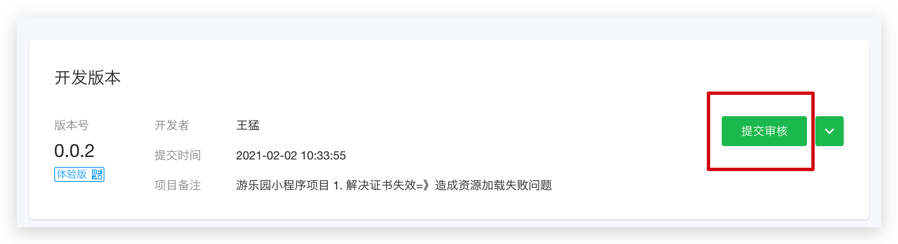

## uni-app介绍

`uni-app` 是一个**使用 [Vue.js](https://vuejs.org/) 开发所有前端应用的框架**，开发者编写一套代码，可发布到 iOS、Android、H5、以及各种小程序（微信/支付宝/百度/头条/QQ/钉钉）等多个平台。

[去官网](https://uniapp.dcloud.io)




## 搭建 uni-app 项目

两种搭建项目的方式

 1. [通过 HBuilderX 可视化界面](https://uniapp.dcloud.io/quickstart?id=_1-通过-hbuilderx-可视化界面)

    可视化的方式比较简单，HBuilderX 内置相关环境，开箱即用，无需配置 nodejs。

    开始之前，开发者需先下载安装 HBuilderX ，[官方 IDE 下载地址](http://www.dcloud.io/hbuilderx.html)



2. [通过vue-cli命令行](https://uniapp.dcloud.io/quickstart?id=_2-通过vue-cli命令行)

   也可以使用 `cli` 脚手架，可以通过 `vue-cli` 创建 `uni-app` 项目。

   **步骤**

   1. 全局安装 vue-cli：`npm install -g @vue/cli`
   2. 执行 cli 命令：`vue create -p dcloudio/uni-preset-vue heima-ugo`
   3. 选择**默认模版**



​			4. 运行项目：`npm run dev:mp-weixin`，成功后会自动打包生成小程序项目代码

​				此处除了运行微信小程序，还可以运行其他平台小程序

| 值            | 平台           |
| ------------- | -------------- |
| h5            | H5             |
| mp-alipay     | 支付宝小程序   |
| mp-baidu      | 百度小程序     |
| **mp-weixin** | 微信小程序     |
| mp-toutiao    | 字节跳动小程序 |
| mp-qq         | qq 小程序      |

​				5. 打开小程序开发者工具，**导入上一步生成的小程序项目代码**，填写 appid




## uni-app 开发说明和注意事项

### 目录结构

一个uni-app工程，默认包含如下目录及文件：

```
┌─components           uni-app组件目录
│  └─comp-a.vue        可复用的a组件
├─pages                业务页面文件存放的目录
│  ├─index
│  │  └─index.vue      index页面
├─static      存放应用引用静态资源（如图片、视频等）的目录，注意：静态资源只能存放于此
├─App.vue              应用配置，用来配置App全局样式以及监听 应用生命周期
├─main.js              Vue初始化入口文件
├─manifest.json        配置应用名称、appid、logo、版本等打包信息
└─pages.json           配置页面路由、导航条、选项卡等页面类信息
```

### [开发规范](https://uniapp.dcloud.io/frame)

开发模式：**vue + 原生小程序部分用法**

为了实现多端兼容，综合考虑编译速度、运行性能等因素，`uni-app` 约定了如下开发规范：

- 页面文件遵循 [Vue 单文件组件 (SFC) 规范](https://vue-loader.vuejs.org/zh/spec.html)
- 组件标签靠近小程序规范，详见[uni-app 组件规范](https://uniapp.dcloud.io/component/README)
- 接口能力（JS API）靠近微信小程序规范，但需将前缀 `wx` 替换为 `uni`，详见[uni-app接口规范](https://uniapp.dcloud.io/api/README)
- 数据绑定及事件处理同 `Vue.js` 规范，同时补充了 App 及页面的生命周期
- 为兼容多端运行，建议使用 flex 布局进行开发

### uni-app 生命周期

uni-app 框架的生命周期结合了 vue 和微信小程序的生命周期

应用：App.vue  onLanch

页面: onLoad，在该阶段发送请求

组件： mounted


### 分包配置

> 因小程序有体积和资源加载限制，小程序平台提供分包方式，优化小程序下载和启动速度。

在小程序启动时，**默认会下载主包并启动主包内页面**，当用户进入分包内某个页面时，会把对应分包自动下载下来，下载完成后再进行展示。此时终端界面会有等待提示。

* 所谓的**主包**（1个），即放置默认**启动页面/TabBar 页面**，以及一些所有分包都需用到**公共资源**/JS 脚本
* **分包**（多个）默认不需要加载页面资源

#### **配置步骤**

1. 分拆页面 => 拆分非标签页为单独包（分包）
2. 新建分包目录 ，和 pages 目录同级
3. 在`pages.json`中配置`subPackages`

```json
  "pages": [
    // pages 数组中第一项表示应用启动页
    {
      "path": "pages/index/index",
      "style": {
        "enablePullDownRefresh": true
      }
    }
  ],
  // 分包
  "subPackages": [
    {
      // 子包的根目录
      "root": "packone",
      // 子包由哪些页面组成
      "pages": [
        {
          "path": "goods/index",
          "style": {
            "navigationBarTitleText": "详情"
          }
        },
        {
          "path": "list/index"
        },
      ]
    }
  ]
```

4. 重新执行`npm run dev:mp-weixin`，微信开发者工具中，查看分包大小



​	**注意**：

1. 微信小程序微信小程序每个分包的大小是2M，总体积一共不能超过20M
2. `subPackages` 里的 pages 的路径是 `root` 下的相对路径，不是全路径。


## 常用 API

> uni-app下使用小程序的API是以[uni.api](https://uniapp.dcloud.io/api/system/info?id=getsysteminfosync)（替代 wx.api ）

[详见官网](https://uniapp.dcloud.net.cn/api/)

### 获取系统信息

uni-app 提供了异步( `uni.getSystemInfo` )和同步( `uni.getSystemInfoSync` )的2个 API 获取系统信息。

- `uni.getSystemInfoSync().windowHeight`：获取屏幕可视区高度


### tabBar 控制

- `uni.hideTabBar() / uni.showTabBar() `：隐藏/显示底部 tabBar


### 数据请求

uni.request 基本方法代替了 wx.request 方法，[官方文档](https://uniapp.dcloud.io/api/request/request?id=request)

uni.request 是异步的方法。如果不传入 success、fail、complete 等 callback 参数，将以 Promise 返回数据。

```js
onLoad() {
  uni.request({
    url: "xxx"
  }).then(res => {
    console.log("结果：", res);
  })
}
```

开发中通常也会对请求模块进行封装，以下为较简单的封装示例

```js
/**
 * uni.request() 封装
 * @param 请求参数
 * uni.showLoading 加载效果
 * uni.hideLoading() 隐藏加载效果，配套使用
 */
const BASE_URL = "https://uinav.com"
async function request ({ url, header = {}, method, data }) {
  uni.showLoading({
    title: '加载中...'
  })
  // 处理token
  let token = uni.getStorageSync('token')
  if (token) {
    header.Authorization = token
  }
  let [error, res] = await uni.request({
    url: BASE_URL + url,
    header,
    method,
    data
  })
  uni.hideLoading()
  if (!error) {
    const _data = {
      msg: res.data.meta,
      data: res.data.message
    }
    return data
  } else {
    return new Error(error)
  }
}

// vue 插件形式 定义插件，后续组件中可以通过 this 来访问
const requestPlugin = {
  install(Vue) {
    Vue.prototype.request = request
  }
}
export default requestPlugin
```

```js
import MyRequest from '@/utils/request';

// 入口文件 注册插件
Vue.use(MyRequest)
```


### 下拉刷新-配置

uni-app 封装了相关 API

- enablePullDownRefresh：开启配置
- uni.stoppulldownrefresh()：终止状态

**配置步骤**

1. 在`pages.json`文件中 pages 字段：配置 **首页** 的下拉刷新效果
2. style(window) 属性中：`"enablePullDownRefresh": true`

```json
{
  "path": "pages/index/index",
  "style": {
     "enablePullDownRefresh": true, // 允许下拉
     "backgroundColor": "#fd1800" // 下拉区域背景色
   }
},
```

3. 获取完相关数据后调用 `uni.stopPullDownRefresh()` 方法关闭

```js
 onPullDownRefresh() {
    Promise.all([this.getSwiper(), this.getNavs())
    .then(
      () => {
        // 执行完停止loading
        uni.stopPullDownRefresh()
      }
    )
  }
```

注意：

* 模拟器中：用户手动触发，会自动关闭 loading 效果
* 真机测试：需要调用 uni.stopPullDownRefresh() 方法关闭


### 页面滚动

将页面滚动到目标位置。[官网介绍](https://uniapp.dcloud.net.cn/api/ui/scroll.html#pagescrollto)

```js
uni.pageScrollTo({ scrollTop: 0 })
```

**监听页面滚动条**： onPageScroll()

```js
// 和 data 平级位置
onPageScroll(e) {
  // console.log('页面滚动啦')
}
```

**页面滚动到底**：onReachBottom()，常用于下拉下一页数据。

此处可在 pages.json 里定义具体页面底部的触发距离 [onReachBottomDistance](https://uniapp.dcloud.net.cn/collocation/pages#globalstyle)，比如设为50，那么滚动页面到距离底部 50px 时，就会触发 onReachBottom 事件。

此外，在 scroll-view 组件中，滚动到底会触发 scrolltolower() 事件

```js
// 和 data 平级位置
onPageScroll(e) {
  // console.log('页面滚动到底啦')
}
```


### 数据缓存

- uni.setStorage(OBJECT)：异步存储
- uni.setStorageSync(KEY,DATA)：同步存储
-  uni.getStorage(OBJECT)：异步获取缓存数据
-  uni.getStorageSync(KEY)：同步获取缓存数据

```js
uni.getStorageSync("history") // 同步获取缓存数据
uni.removeStorageSync("history") // 同步移除缓存数据
uni.setStorageSync( "history",this.history ) // 同步存储数据
```


### open-type 有效值

| **值**  | **说明**                                                     |
| ------- | ------------------------------------------------------------ |
| contact | 打开客服会话，如果用户在会话中点击消息卡片后返回应用，可以从 @contact 回调中获得具体信息 |
| share   | 触发用户转发                                                 |
|         |                                                              |

```html
<button open-type="contact" class="icon-handset">联系客服</button>
<button class="item icon-arrow" open-type="share">分享优购</button>
```


### 收货地址

> 选择和编辑收货地址的页面，由微信客户端提供

通过 `uni.chooseAddress` API 获取当前微信账号的收货地址

```js
uni.chooseAddress({
  success(res) {
    console.log(res)
  }
})
```


### 拨打电话

通过 `uni.makePhoneCall()` API 来拨打电话

```js
uni.makePhoneCall({
	phoneNumber: '10086' //仅为示例
})
```


### 获取用户信息

通过 `uni.getUserProfile()` API 获取用户信息。每次请求都会弹出授权窗口，用户同意后返回 userInfo。`desc` 属性必须填写

```js
wx.getUserProfile({
   desc: '用于完善用户资料', // 声明获取用户个人信息后的用途，后续会展示在弹窗中
   success: (res) => {
		console.log(' 当前用户信息 ',res)
	}
})
```


### 登录

一般分为两种

1. 直接在前端调用微信接口登录，一般需要 code( api 获取)，AppID(小程序ID)，AppSecret(小程序密钥)访问微信服务器，成功返回：1. openid是用户标识  2. session_key是解密用的（UnionID解密等），此方法非常不安全，不建议使用
2. 调用自己的服务器接口（会对接微信服务器）

| 参数名        | 说明                                                         |
| ------------- | ------------------------------------------------------------ |
| code          | 临时登录凭证，有效期五分钟                                   |
| session_key   | 会话密钥，服务端通过 [code2Session](https://developers.weixin.qq.com/miniprogram/dev/api/open-api/login/code2Session.html) 获取 |
| openId        | 用户唯一标识, 永远不变, 服务端通过 code 获取                 |
| appSecret     | 小程序的 app secret, 可以和 code, appId 一起换取 session_key |
| appId         | 小程序唯一标识                                               |
| signature     | 用于校验用户信息是否无篡改                                   |
| iv            | 加密算法的初始向量                                           |
| encryptedData | 包含敏感信息的用户信息, 是加密的                             |
| rawData       | 不包括敏感信息的原始数据字符串，用于计算签名                 |

```js
async getUserInfo () {
  const [error, user] = await uni.getUserProfile({ desc: '获取微信用户信息' })
  // 请求失败，err 是失败对象， 请求成功，err为 null
  if (!error) {
    this.login(user)
  }
},
// 调用接口登录
async login(user) {
  // 登录所需参数
  const { encryptedData, iv, rawData, signature } = user
  // 微信用户登录凭证 =》 code
  const [err, data] = await uni.login({
       provider: 'weixin',
       onlyAuthorize：true,
  })
  if (!err) {
    let res = await this.request({
      url: "/api/public/v1/users/wxlogin",
      method: "post",
      data: {
        encryptedData,
        iv,
        rawData,
        signature,
        code: data.code
      }
    });
    console.log(res);
  }
```

**登陆失败**：一般是因为**当前开发者 AppID 和服务器端使用的不一致**造成，工作中使用公司提供的 

AppID 即可解决

**`Error: Illegal Buffer`**报错：可能是 session_key 没有及时更新，建议提前调用 uni.login()

```js
async onLoad () {
 // 页面加载时调用，获取 code
  const [error, data] = await uni.login()
  if (!error) {
    console.log(data)
    // code 参数存储到 this，后续使用访问 this.code 即可
    this.code = data.code
  }
},
```


### 微信支付

[支付业务流程](https://pay.weixin.qq.com/wiki/doc/api/wxa/wxa_api.php?chapter=7_4&index=3)



**前端：主要处理第三步，获取支付信息，调起支付窗口**

1. 使用 **`uni.login`** 获取临时登录凭证 code ，发送到后端获取 openId => 微信登录
2. 将 **`openId`** 以及相应需要的商品信息发送到后端，换取服务端进行支付的签名等信息  => 创建订单
3. 接收返回的信息（必须要包含发起微信支付 **`uni.requestPayment的参数`** ），发起微信支付

[详见官网](https://uniapp.dcloud.net.cn/api/plugins/payment.html#requestpayment)

```js
uni.requestPayment({
    "provider": "wxpay", 
    "orderInfo": {
        "appid": "wx499********7c70e",  // 微信开放平台 - 应用 - AppId，注意和微信小程序、公众号 AppId 可能不一致
        "noncestr": "c5sEwbaNPiXAF3iv", // 随机字符串
        "package": "Sign=WXPay",        // 固定值
        "partnerid": "148*****52",      // 微信支付商户号
        "prepayid": "wx202254********************fbe90000", // 统一下单订单号 
        "timestamp": 1597935292,        // 时间戳（单位：秒）
        "sign": "A842B45937F6EFF60DEC7A2EAA52D5A0" // 签名，这里用的 MD5/RSA 签名
    },
    success(res) {},
    fail(e) {}
})
```


## 项目打包-上线

### 步骤

1. 打包

   - hbuildX：发布

   - vue-cli: 执行上线打包：`npm run build:mp-weixin`
2. 到微信开发者工具，导入打包生成的 build/mp-weixin 生产代码
3. 导入成功之后点击 => **上传** => 发布体验版本 =>  通过小程序的后台查看管理版本



4. 体验版本 => 经过测试 => 测试通过 => 提交审核 => 经过 TX 审核通过才能发布线上版本



