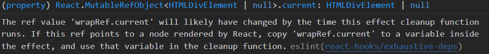

#### 1. The ref value 'XXX' will likely have changed by the time this effect cleanup function runs. If this ref points to a node rendered by React...



在 react 中，使用 useEffect 监听、清除滚动事件时出现的警告

```tsx
useEffect(() => {
	const onScroll = function () {
		const rect = authorRef.current?.getBoundingClientRect()!
		rect.top <= 0 ? setIsShowAuthor(true) : setIsShowAuthor(false)}
		// 监听页面 author top 值
		wrapRef.current?.addEventListener('scroll', onScroll)
		return () => {
			wrapRef.current?.removeEventListener('scroll', onScroll)
		}
}, [])
```

报错信息**意思是 useEffec t在执行清除功能时，wrapRef.current可能发生了改变。如果这个 ref 指向由 React 渲染的节点，将 ‘wrapRef.current’ 在useEffect中 赋值给一个变量，在清除函数中使用该变量。**

**解决**

```tsx
useEffect(() => {
	// 在 useEffect 内新创建变量接收 wrapRef.current 值，销毁时销毁该变量即可
	const wrapDOM = wrapRef.current
	const onScroll = function () {
		const rect = authorRef.current?.getBoundingClientRect()!
		rect.top <= 0 ? setIsShowAuthor(true) : setIsShowAuthor(false)}
		// 监听页面 author top 值
		wrapDOM?.addEventListener('scroll', onScroll)
		return () => {
			wrapDOM?.removeEventListener('scroll', onScroll)
		}
}, [])
```

