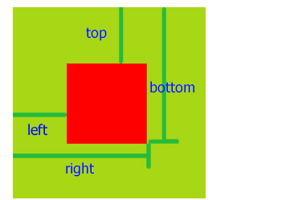

# getBoundingClientRect()

 getBoundingClientRect() 方法用来获取元素位置，该方法没有参数。用于获得页面中某个元素的左，上，右和下分别相对浏览器视窗的位置。 通常用来判断某个元素是否进入可视区域

getBoundingClientRect() 是 DOM 元素到浏览器可视范围的距离（不包含文档卷起的部分）。



该函数返回一个 Object 对象，该对象有6个属性：top,lef,right,bottom,width,height

```html
<div id="box"></div>
<script>
let object=document.getElementById('box');  
rectObject = object.getBoundingClientRect();
	/*  rectObject.top：元素上边到视窗上边的距离;
		rectObject.right：元素右边到视窗左边的距离;
		rectObject.bottom：元素下边到视窗上边的距离;
		rectObject.left： 元素左边到视窗左边的距离;
		rectObject.width：是元素自身的宽
		rectObject.height 是元素自身的高 */
</script>

```

  

# scroll 家族

scroll 用于获取元素内容的真实宽高与位置

```js
//  scrollWidth/scrollHeight :  内容真实宽高
//  scrollLeft/scrollTop : 滚动条滚动左/上边的距离 (该值可以修改)
```


# IntersectionObserver

IntersectionObserver 是一个构造函数，用来判断元素是否进入可视区域。

其支持两个参数，callback 是当被监听元素可见性发生变化时触发的回调函数，options

 是一个可选的配置参数，有默认的属性值。

```js
var observer = new IntersectionObserver(callback[, options])
```

参数 callback 可接受两个参数

- entries：是一个观察者数组，可以放入多个需要观察的元素
- observer：被调用的 `IntersectionObserver` 实例对象

可选参数 options，有三个可选配置参数

- root：监听元素的祖先元素，其边界被视为视口，被监视元素在根元素不可见部分都被视为不可见
- rootMargin：监视元素距离根元素边界的偏移量，可以有效的缩小或扩大根的判定范围从而满足计算需要
- threshold：规定了一个监听目标与边界盒交叉区域的比例值，可以是一个具体的数值或是一组 0.0 到 1.0 之间的数组。若指定值为 0.0，则意味着监听元素即使与根有 1 像素交叉，此元素也会被视为可见。若指定值为 1.0，则意味着整个元素都在可见范围内时才算可见。

```js
 var img = document.querySelector("img")
 var observer = new IntersectionObserver((entries,observer)=>{
 //  entries： 观察者数组；	observer：实例对象
    console.log(entries,observer)
// arr[0]: 被监视元素；isIntersecting：被监视元素是否进入交叉点，即是否可见
    if(arr[0].isIntersecting) {
        // 用于图片懒加载，当图片元素进入可视区域时给 src 赋值
        img.src = img.getAttribute('data-src')
        // 图片加载失败时赋值默认值
        img.onerror = function(){
             img.src="https://gimg2.baidu.com/image"
        }
     }
},
// 配置项 options
 {rootMargin: "100px"})
// 需要监视的元素，调用 observe() 方法
// observer.observe(img)
const imgList = document.querySelectorAll('img');
imgList.forEach((el) => {
    // 监视元素
    observer.observe(el)
})
// 取消某个元素的观察
observer.unobserve(img)
// 取消所有观察
observer.disconnect();
```

