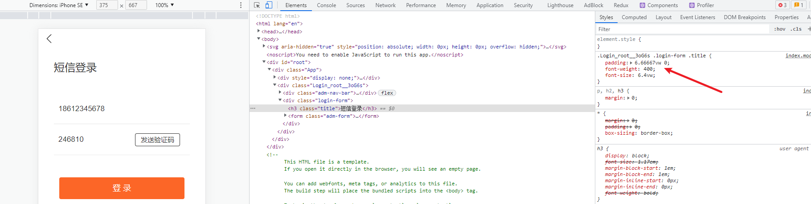

# 移动端 REM 适配

Vant 中的样式默认使用 `px` 作为单位，如果需要使用 `rem` 单位，推荐使用以下两个工具：

- [postcss-pxtorem](https://github.com/cuth/postcss-pxtorem) 是一款 postcss 插件，用于将单位转化为 rem
- [lib-flexible](https://github.com/amfe/lib-flexible) 用于设置 rem 基准值

分别将这两个工具配置到项目中完成 REM 适配。

**一、使用 [lib-flexible](https://github.com/amfe/lib-flexible) 动态设置 REM 基准值（html 标签的字体大小）**

1、安装

```shell
# yarn add amfe-flexible
npm i amfe-flexible
```

2、然后在 `main.js` 中加载执行该模块

```javascript
import 'amfe-flexible'
```

最后测试：在浏览器中切换不同的手机设备尺寸，观察 html 标签 `font-size` 的变化。


> 例如在 iPhone 6/7/8 设备下，html 标签字体大小为 37.5 px


> 例如在 iPhone 6/7/8 Plus 设备下，html 标签字体大小为 41.4 px


**二、使用 [postcss-pxtorem](https://github.com/cuth/postcss-pxtorem) 将 `px` 转为 `rem`**

1、安装

```shell
# yarn add -D postcss-pxtorem
# -D 是 --save-dev 的简写
npm install postcss-pxtorem -D
```

2、然后在**项目根目录**中创建 `.postcssrc.js` 文件

```javascript
module.exports = {
  plugins: {
    'autoprefixer': {
      browsers: ['Android >= 4.0', 'iOS >= 8']
    },
    'postcss-pxtorem': {
      rootValue: 37.5,
      propList: ['*']
    }
  }
}

```

3、**配置完毕，重新启动服务**

最后测试：**刷新浏览器页面**，审查元素的样式查看是否已将 `px` 转换为 `rem`。


> 这是没有配置转换之前的。


> 这是转换之后的，可以看到 px 都被转换为了 rem。


**需要注意的是：**

- 该插件**不能转换行内样式中的 `px`**，例如 `<div style="width: 200px;"></div>`

## 关于 `.postcssrc.js` 配置文件

```js
module.exports = {
  plugins: {
    'autoprefixer': {
      browsers: ['Android >= 4.0', 'iOS >= 8']
    },
    'postcss-pxtorem': {
      rootValue: 37.5,
      propList: ['*']
    }
  }
}

```

`.postcssrc.js` 是 PostCSS 的配置文件。

（1）PostCSS 介绍

[PostCSS](https://postcss.org/) 是一个处理 CSS 的处理工具，本身功能比较单一，它主要负责解析 CSS 代码，再交由插件来进行处理，它的插件体系非常强大，所能进行的操作是多种多样的，例如：

- [Autoprefixer](https://github.com/postcss/autoprefixer) 插件可以实现自动添加浏览器相关的声明前缀
- [PostCSS Preset Env](https://github.com/csstools/postcss-preset-env) 插件可以让你使用更新的 CSS 语法特性并实现向下兼容
- [postcss-pxtorem](https://github.com/cuth/postcss-pxtorem) 可以实现将 px 转换为 rem
- ...

目前 PostCSS 已经有 [200 多个功能各异的插件](https://github.com/postcss/postcss/blob/master/docs/plugins.md)。开发人员也可以根据项目的需要，开发出自己的 PostCSS 插件。


PostCSS 一般不单独使用，而是与已有的构建工具进行集成。

[Vue CLI 默认集成了 PostCSS](https://cli.vuejs.org/zh/guide/css.html#postcss)，并且默认开启了 [autoprefixer](https://github.com/postcss/autoprefixer) 插件。

> Vue CLI 内部使用了 PostCSS。
>
> 你可以通过 `.postcssrc` 或任何 [postcss-load-config](https://github.com/michael-ciniawsky/postcss-load-config) 支持的配置源来配置 PostCSS。也可以通过 `vue.config.js` 中的 `css.loaderOptions.postcss` 配置 [postcss-loader](https://github.com/postcss/postcss-loader)。
>
> 我们默认开启了 [autoprefixer](https://github.com/postcss/autoprefixer)。如果要配置目标浏览器，可使用 `package.json` 的 [browserslist](https://cli.vuejs.org/zh/guide/browser-compatibility.html#browserslist) 字段。

（2）Autoprefixer 插件的配置


[autoprefixer](https://github.com/postcss/autoprefixer) 是一个自动添加浏览器前缀的 PostCss 插件，`browsers` 用来配置兼容的浏览器版本信息，但是写在这里的话会引起编译器警告。

```
Replace Autoprefixer browsers option to Browserslist config.
Use browserslist key in package.json or .browserslistrc file.

Using browsers option can cause errors. Browserslist config
can be used for Babel, Autoprefixer, postcss-normalize and other tools.

If you really need to use option, rename it to overrideBrowserslist.

Learn more at:
https://github.com/browserslist/browserslist#readme
https://twitter.com/browserslist
```

警告意思就是说你应该将 `browsers` 选项写到 `package.json` 或 `.browserlistrc` 文件中。

```json
// package.json 中添加
 "browserslist": [
    "> 1%",
    "last 2 versions",
    "not dead"
  ]

// 或者新建 .browserlistrc 文件
> 1%
last 2 versions
not dead
```

> 具体语法请[参考这里](https://github.com/browserslist/browserslist)。

（3）postcss-pxtorem 插件的配置


- `rootValue`：表示根元素字体大小，它会根据根元素大小进行单位转换
- `propList` 用来设定可以从 px 转为 rem 的属性
  - 例如 `*` 就是所有属性都要转换，`width` 就是仅转换 `width` 属性


`rootValue` 应该如何设置呢？

```
如果你使用的是基于 lib-flexable 的 REM 适配方案，则应该设置为你的设计稿的十分之一。
例如设计稿是 750 宽，则应该设置为 75。
```


大多数设计稿的原型都是以 iphone6 为原型，iphone6 设备的宽是 750

但是如果使用 Vant ，官方建议设置为 37.5，为什么呢？

```
因为 Vant 是基于 375 写的，所以如果你设置为 75 的话，Vant 的样式就小了一半。
```

所以如果设置为 `37.5` 的话，Vant 的样式是没有问题的，但是我们在测量设计稿的时候都必须除2才能使用，否则就会变得很大。

这样做其实也没有问题，但是有没有更好的办法呢？我就想实现测量多少写多少（不用换算）。于是聪明的你就想，可以不可以这样来做？

- 如果是 Vant 的样式，就把 `rootValue` 设置为 37.5 来转换
- 如果是我们的样式，就按照 75 的 `rootValue` 来转换


通过[查阅文档](https://github.com/cuth/postcss-pxtorem#options)我们可以看到 `rootValue` 支持两种参数类型：

- 数字：固定值
- 函数：动态计算返回
  - postcss-pxtorem 处理每个 CSS 文件的时候都会来调用这个函数
  - 它会把被处理的 CSS 文件相关的信息通过参数传递给该函数

所以我们修改配置如下：

```js
/**
 * PostCSS 配置文件
 */

module.exports = {
  // 配置要使用的 PostCSS 插件
  plugins: {
    // 配置使用 autoprefixer 插件
    // 作用：生成浏览器 CSS 样式规则前缀
    // VueCLI 内部已经配置了 autoprefixer 插件
    // 所以又配置了一次，所以产生冲突了
    // 'autoprefixer': { // autoprefixer 插件的配置
    //   // 配置要兼容到的环境信息
    //   browsers: ['Android >= 4.0', 'iOS >= 8']
    // },

    // 配置使用 postcss-pxtorem 插件
    // 作用：把 px 转为 rem
    'postcss-pxtorem': {
      rootValue ({ file }) {
        return file.indexOf('vant') !== -1 ? 37.5 : 75
      },
      propList: ['*']
    }
  }
}

```

配置完毕，把服务重启一下，最后测试，very good。


## Vue 配置方法

在 Vue 项目中使用步骤如下

1. 下包：此处推荐使用 5.1.1 版本，最新版本可能会报错

```js
yarn add amfe-flexible postcss-pxtorem@5.1.1
```

2. 配置

   - 配置 `amfe-flexible`：在 `main.js` 中导入

   ```js
   import 'amfe-flexible'
   ```

   - 根目录新建 `.postcssrc.js` 文件并配置

   ```js
   module.exports = {
     plugins: {
       autoprefixer: {
         browsers: ["Android >= 4.0", "iOS >= 8"],
       },
       // 'postcss-pxtorem': {
       //   rootValue: 37.5,
       //   propList: ['*']
       // }
       // 如需使用 vant 组件库可做如下配置，如直接使用使用上述配置
       "postcss-pxtorem": {
         rootValue({file}) {
           return file.indexOf("vant") !== -1 ? 37.5 : 75;
         },
         propList: ["*"],
       },
     },
   };
   
   ```

   3. 配置完毕重启服务


## React 配置方法

react 由于像 webpack，babel 等等都是被 creat react app 封装到了 react-scripts 这个项目当中，所以如需适配有两种方法

### 1. npm run eject 命令

> 执行 npm run eject 命令（不推荐），该命令会将原本 creat react app 对 webpack，babel等相关配置的封装弹射出来，操作不可逆。使用须慎重

**步骤**

1. 执行如下命令并下包，执行完毕后会在根目录生成 config 目录

```js
yarn eject or npm run eject
// 下包
yarn add amfe-flexible postcss-pxtorem@5.1.1
```

2. 在 config 目录中找到 webpack.config.js 文件中配置如下信息


```js
// 搜索 postcss-normalize ，找到配置位置添加如下内容
'postcss-normalize',
[
  'postcss-pxtorem',
  {
      rootValue: 37.5,
      propList: ['*']
  }
]
// 或者
'postcss-normalize',
require('postcss-pxtorem')({
	rootValue: 37.5,
	selectorBlackList: [], //过滤
	propList: ['*'],
	exclude: /node_modules/i,
})
```

3. 重启服务即可生效


### 2. craco 配置

> craco 是用来对 CRA 创建的项目进行自定义配置的工具，更推荐这种方法

**步骤**

1. 下包

```js
yarn add @craco/craco amfe-flexible postcss-pxtorem@5.1.1
```

2. 创建并配置 `craco.config.js` 文件

```js
module.exports = {
  // ... 省略其他
  style: {
    postcss: {
      mode: 'extends',
      loaderOptions: (postcssLoaderOptions, { env, paths }) => {
        postcssLoaderOptions.postcssOptions.plugins = [
          ...postcssLoaderOptions.postcssOptions.plugins,
          [
            'autoprefixer',
            {
              overrideBrowserslist: [
                'last 2 version',
                '>1%',
                'Android >= 4.0',
                'iOS >= 7'
              ]
            }
          ],
          [
            'postcss-pxtorem',
            {
              rootValue ({ file }) {
                // return file.indexOf('antd-mobile') > -1 ? 37.5 : 75;
                return 37.5
              },
              unitPrecision: 2, // 只转换到两位小数
              propList: ['*']
            }
          ]
        ]
        return postcssLoaderOptions
      }
    }
  }
}

```

3. 重启服务发现已生效


# 移动端 VW 适配

### Vue 配置方法

**步骤**

1. 下包

```js
yarn add postcss-px-to-viewport
```

2. 创建并配置 `.postcssrc.js` 文件

```js
module.exports = {
  plugins: {
    autoprefixer: {}, // 用来给不同的浏览器自动添加相应前缀，如-webkit-，-moz-等等
    "postcss-px-to-viewport": {
      unitToConvert: "px", // 要转化的单位
      viewportWidth: 375, // UI设计稿的宽度
      unitPrecision: 6, // 转换后的精度，即小数点位数
      propList: ["*"], // 指定转换的css属性的单位，*代表全部css属性的单位都进行转换
      viewportUnit: "vw", // 指定需要转换成的视窗单位，默认vw
      fontViewportUnit: "vw", // 指定字体需要转换成的视窗单位，默认vw
      selectorBlackList: ["wrap"], // 指定不转换为视窗单位的类名，
      minPixelValue: 1, // 默认值1，小于或等于1px则不进行转换
      mediaQuery: true, // 是否在媒体查询的css代码中也进行转换，默认false
      replace: true, // 是否转换后直接更换属性值
      exclude: [/node_modules/], // 设置忽略文件，用正则做目录名匹配
      landscape: false // 是否处理横屏情况
    }
  }
};

```

3. 或者不创建 `.postcssrc.js`文件，直接在 `vue.config.js` 文件中配置

```js
const pxtoviewport = require('postcss-px-to-viewport')
module.exports = {
  // ...省略其他配置
  css: {
    loaderOptions: {
      postcss: {
        plugins: [
         pxtoviewport({
            viewportWidth: 375 // 视窗的宽度，对应的是设计稿的宽度，一般是750
          })
        ]
      }
    }
  }
}

```

4. 配置完毕后重启服务器即可生效


### React 配置方法

使用最新版本 create-react-app 创建项目时，默认已经引入了 postcss8，在对其进行配置   postcss-px-to-viewport ,打算适配移动端视口时，会出现安装的 postcss-px-to-viewport 不适配最新版本的 postcss8

 报出如下问题：

```js
postcss-px-to-viewport: postcss.plugin was deprecated. Migration guide:
https://evilmartians.com/chronicles/postcss-8-plugin-migration
```

**解决**：安装适配8的版本

```
yarn add postcss-px-to-viewport-8-plugin
```

安装后还需进行配置， craco 官方给出的配置方式无法生效，详见 [参考文章](https://blog.csdn.net/qq_43616690/article/details/125764625)

```js
module.exports = {
  // ... 省略其他配置
  style: {
    postcss: {
      //   plugins: [vw]
      mode: 'extends',
      loaderOptions: {
        postcssOptions: {
          ident: 'postcss',
          plugins: [
            [
              'postcss-px-to-viewport-8-plugin',
              {
                viewportWidth: 375 // 设计稿的视口宽度
              }
            ]
          ]
        }
      }
    }
  }
}

```

配置完毕启动服务，发现配置已生效

