## 1. canvas 简介

`canvas` 是 HTML5 新增的，一个可以使用脚本(通常为 JavaScript )在其中绘制图像的 HTML 元素。它可以用来制作照片集或者制作简单(也不是那么简单)的动画，甚至可以进行实时视频处理和渲染。

它最初由苹果内部使用自己 MacOS X WebKit 推出，供应用程序使用像仪表盘的构件和 Safari 浏览器使用。 后来，有人通过 Gecko 内核的浏览器 (尤其是 Mozilla 和 Firefox )，Opera 和 Chrome 和超文本网络应用技术工作组建议为下一代的网络技术使用该元素。

Canvas 是由 HTML 代码配合高度和宽度属性而定义出的可绘制区域。JavaScript 代码可以访问该区域，类似于其他通用的二维 API，通过一套完整的绘图函数来动态生成图形。

## 2. Canvas 基本使用

### 2.1 `canvas `元素

```html
<canvas id="canvas" width="300" height="300"></canvas>
```

`canvas` 看起来和 `img`标签一样，只是 `canvas` 只有两个可选的属性 width、heigth 属性，而没有 src、alt 属性。

**注意**：与 `img`元素不同，`canvas`元素**需要**结束标签(`</canvas>`)。如果结束标签不存在，则文档的其余部分会被认为是替代内容，将不会显示出来。

如果不给 `canvas` 设置 widht、height 属性时，则默认 width 为 300、height 为 150,单位都是 px。也可以使用 css 属性来设置宽高，但是如宽高属性和初始比例不一致，他会出现扭曲。所以，建议永远不要使用 css 属性来设置 canvas 的宽高。

由于某些较老的浏览器（尤其是 IE9 之前的 IE 浏览器）或者浏览器不支持 HTML 元素`canvas`，在这些浏览器上你应该总是能展示替代内容。

```html
<canvas> 你的浏览器不支持canvas,请升级你的浏览器 </canvas>
```

支持 `canvas` 的浏览器会只渲染 `canvas` 标签，而忽略其中的替代内容。不支持 ` canvas` 的浏览器则 会直接渲染替代内容。

```html
<canvas>
	
</canvas>
```

### 2.2 渲染上下文(Thre Rending Context)

`canvas`会创建一个固定大小的画布，会公开一个或多个 **渲染上下文**(画笔)，使用 **渲染上下文**来绘制和处理要展示的内容。

```js
var canvas = document.getElementById('tutorial')
// 获得 2d 上下文对象
var ctx = canvas.getContext('2d')
```

### 2.3 检测支持性

检测当前浏览器是否支持 canvas

```js
var canvas = document.getElementById('canvas')

if (canvas.getContext) {
	var ctx = canvas.getContext('2d')
	// drawing code here
} else {
	// canvas-unsupported code here
}
```

## 3. 绘制形状

### 绘制矩形

`canvas` 只支持一种原生的 图形绘制：矩形。所有其他图形都至少需要生成一种路径( `path`)。不过，我们拥有众多路径生成的方法让复杂图形的绘制成为了可能。

> `canvas`t 提供了三种方法绘制矩形

1. `fillRect(x, y, width, height)`

   绘制一个填充的矩形

2. `strokeRect(x, y, width, height)`

   绘制一个矩形的边框

3. `clearRect(x, y, widh, height)`

   清除指定的矩形区域，然后这块区域会变的完全透明。

**说明**：

这 3 个方法具有相同的参数。 `x, y`：指的是矩形的左上角的坐标。(相对于`canvas`的坐标原点)

`width, height`：指的是绘制的矩形的宽和高。

```js
// 注意：需先配置颜色再来绘制矩形，否则生成的矩形是默认黑色
ctx.fillStyle = 'green' // 矩形颜色
ctx.fillRect(300, 100, 100, 100) //绘制矩形
ctx.fillStyle = '#f00' // 边框颜色
ctx.strokeRect(100, 100, 100, 100) // 矩形边框
ctx.clearRect(300, 100, 50, 50) // 清除画布
```

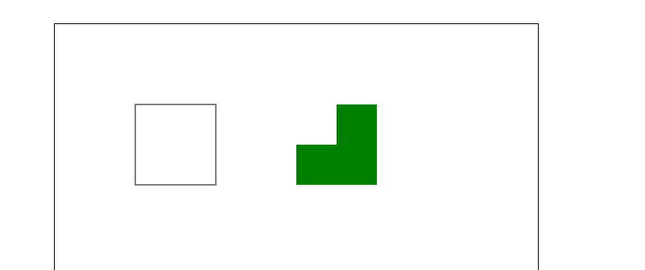

## 4. 绘制路径(`path`)

> 图形的基本元素是路径。

路径是通过不同颜色和宽度的线段或曲线相连形成的不同形状的点的集合。

一个路径，甚至一个子路径，都是闭合的。

> 使用路径绘制图形需要一些额外的步骤：

1. 创建路径起始点
2. 调用绘制方法去绘制出路径
3. 把路径封闭
4. 一旦路径生成，通过描边或填充路径区域来渲染图形。

> 下面是需要用到的方法

1. beginPath()

   新建一条路径，路径一旦创建成功，图形绘制命令被指向到路径上生成路径

2. moveTo(x, y)

   把画笔移动到指定的坐标(x, y)。相当于设置路径的起始点坐标。

3. closePath()

   闭合路径之后，图形绘制命令又重新指向到上下文中

4. stroke()

   通过线条来绘制图形轮廓

5. fill()

   通过填充路径的内容区域生成实心的图形

### 4.1 绘制线段

```js
function draw() {
	var canvas = document.getElementById('canvas')
	if (!canvas.getContext) return
	var ctx = canvas.getContext('2d')
	ctx.beginPath() //新建一条 path
	ctx.moveTo(50, 50) //把画笔移动到指定的坐标
	ctx.lineTo(200, 50) //绘制一条从当前位置到指定坐标(200, 50)的直线.
	//闭合路径。会画一条从当前点到 path 起始点的直线
	ctx.closePath()
	ctx.stroke() //绘制路径。结束当前绘制
}
draw()
```

### 4.2 绘制三角形边框

```js
// 填充三角形
function drawTriangle() {
	context.beginPath()
	context.moveTo(100, 100)
	context.lineTo(100, 400)
	context.lineTo(400, 400)
	context.closePath() // 此处闭合路径，就会首尾相连形成三角形
	context.stroke()
	context.fillStyle = 'gold'
	context.fill() //填充闭合区域。如果 path 没有闭合，则 fill() 会自动闭合路径
}
drawTriangle()
```

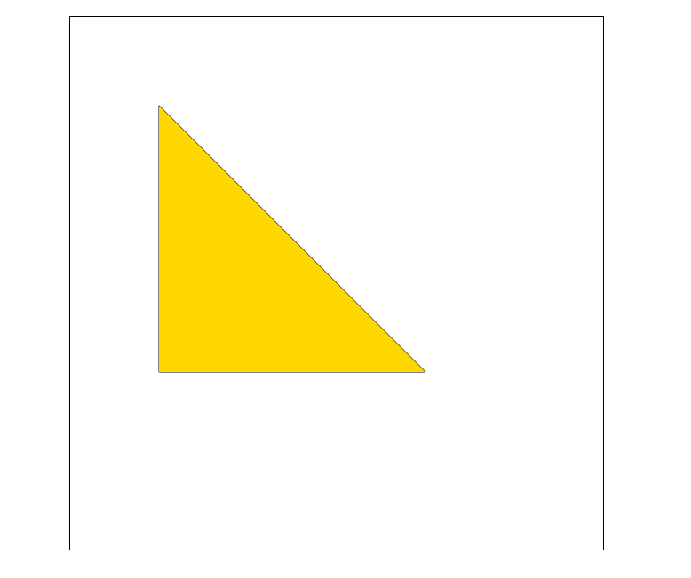

### 4.3 绘制圆弧

> 有两个方法可以绘制圆弧：

1. arc(x, y, r, startAngle, endAngle, anticlockwise):

   以(x, y)为圆心，以 r 为半径，从 startAngle 弧度开始到 endAngle 弧度结束。anticlosewise 是布尔值，true 表示逆时针，false 表示顺时针。(默认是顺时针)

   **注意**：这里的度数都是弧度。

```js
radians = (Math.PI / 180) * degrees //角度转换成弧度
```

2. arcTo(x1, y1, x2, y2, radius):

   根据给定的控制点和半径画一段圆弧，最后再以直线连接两个控制点。

**案例 1：钻石**

```js
// 圆弧
function drawArt() {
	context.translate(300, 300)
	context.rotate((Math.PI / 4) * 5)
	context.beginPath()
	// 圆弧的 x , y , 半径, 起始角度,结束角度, 顺时针 false / 逆时针 true
	context.arc(0, 0, 200, 0, Math.PI / 2, false)
	context.closePath()
	context.stroke()
	context.fillStyle = 'gold'
	context.fill()
	// 三角形
	context.beginPath()
	context.moveTo(200, 0)
	context.lineTo(0, 0)
	context.lineTo(0, 200)
	context.stroke()
	context.closePath()
	context.fill()
}
drawArt()
```

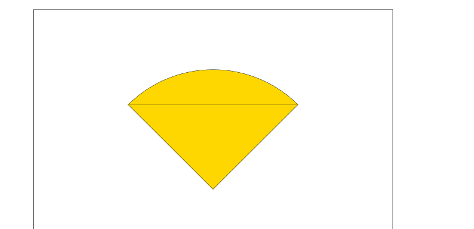

**案例 2：圆弧**

```js
function draw() {
	var canvas = document.getElementById('tutorial')
	if (!canvas.getContext) return
	var ctx = canvas.getContext('2d')
	ctx.beginPath()
	ctx.arc(50, 50, 40, 0, Math.PI / 2, false)
	ctx.stroke()

	ctx.beginPath()
	ctx.arc(150, 50, 40, 0, -Math.PI / 2, true)
	ctx.closePath() // 加入这个 圆弧就会闭合
	ctx.stroke()

	ctx.beginPath()
	ctx.arc(50, 150, 40, -Math.PI / 2, Math.PI / 2, false)
	ctx.fill() // 圆弧填充，默认是黑色

	ctx.beginPath()
	ctx.arc(150, 150, 40, 0, Math.PI, false)
	ctx.fill()
}
draw()
```

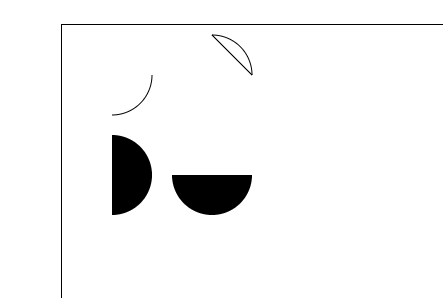

案例三：**线相切的圆弧**

`arcTo`方法的说明：

这个方法可以这样理解。绘制的弧形是由两条切线所决定。

第 1 条切线：起始点和控制点 1 决定的直线。

第 2 条切线：控制点 1 和控制点 2 决定的直线。

**其实绘制的圆弧就是与这两条直线相切的圆弧。**

```js
// 两条直线相切的圆弧
function drawArtTo() {
	// 相切圆弧
	context.beginPath()
	context.moveTo(205, 105)
	// 参数1、2：控制点1坐标   参数3、4：控制点2坐标  参数4：圆弧半径
	context.arcTo(505, 105, 505, 505, 300)
	context.lineTo(505, 500)
	context.stroke()
	context.closePath()

	// 起始点
	context.beginPath()
	context.fillStyle = '#000'
	context.fillRect(200, 100, 10, 10)
	context.moveTo(210, 105)
	context.lineTo(510, 105)
	context.lineWidth = 5
	context.strokeStyle = 'red'
	context.stroke()

	// 控制点1
	context.beginPath()
	context.fillStyle = '#000'
	context.fillRect(500, 100, 10, 10)
	context.moveTo(505, 110)
	context.lineTo(505, 500)
	context.lineWidth = 5
	context.strokeStyle = 'red'
	context.stroke()

	// 控制点2
	context.beginPath()
	context.fillStyle = '#000'
	context.fillRect(500, 500, 10, 10)
	context.stroke()
}
drawArtTo()
```

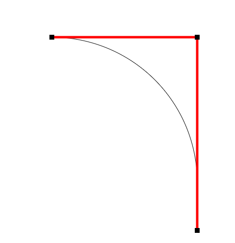

## 5. 添加样式和颜色

在前面的绘制矩形中，只用到了默认的线条和颜色。如果想要给图形上色，有两个重要的属性可以做到。

1. `fillStyle = color`

   设置图形的填充颜色

2. `strokeStyle = color`

   设置图形轮廓的颜色

**注意**：

1. `color` 可以是表示 `css` 颜色值的字符串、渐变对象或者图案对象。

2. 默认情况下，线条和填充颜色都是黑色。
3. 一旦您设置了 `strokeStyle` 或者 `fillStyle` 的值，那么这个新值就会成为新绘制的图形的默认值。如果你要给每个图形上不同的颜色，你需要重新设置 `fillStyle` 或 `strokeStyle` 的值。

### Transparency(透明度)

`globalAlpha = transparencyValue`

这个属性影响到 canvas 里所有图形的透明度，有效的值范围是 0.0 （完全透明）到 1.0（完全不透明），默认是 1.0。

globalAlpha 属性在需要绘制大量拥有相同透明度的图形时候相当高效。不过，使用 rgba()设置透明度更加好一些。

```
context.globalAlpha = 0.5 // 画布整体透明度
```

### line style

`lineWidth = value`：线宽。只能是正值。默认是`1.0`。

起始点和终点的连线为中心，**上下各占线宽的一半**

### lineCap = type

线条末端样式。共有 3 个值：

1. `butt`：线段末端以方形结束
2. `round`：线段末端以圆形结束
3. `square`：线段末端以方形结束，但是增加了一个宽度和线段相同，高度是线段厚度一半的矩形区域。

```js
var lineCaps = ['butt', 'round', 'square']

for (var i = 0; i < 3; i++) {
	ctx.beginPath()
	ctx.moveTo(20 + 30 * i, 30)
	ctx.lineTo(20 + 30 * i, 100)
	ctx.lineWidth = 20
	ctx.lineCap = lineCaps[i]
	ctx.stroke()
}

ctx.beginPath()
ctx.moveTo(0, 30)
ctx.lineTo(300, 30)

ctx.moveTo(0, 100)
ctx.lineTo(300, 100)

ctx.strokeStyle = 'red'
ctx.lineWidth = 1
ctx.stroke()
```

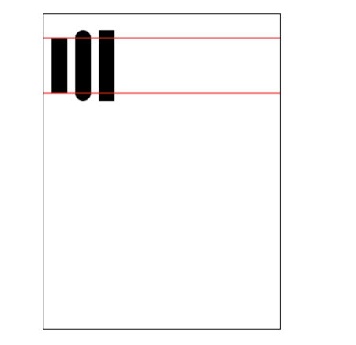

### lineJoin = type

`lineJoin = type`：同一个 path 内，设定线条与线条间接合处的样式。

共有 3 个值 round, bevel 和 miter：

1. round

通过填充一个额外的，圆心在相连部分末端的扇形，绘制拐角的形状。 圆角的半径是线段的宽度。

2. bevel

在相连部分的末端填充一个额外的以三角形为底的区域， 每个部分都有各自独立的矩形拐角。

3. miter(默认)

通过延伸相连部分的外边缘，使其相交于一点，形成一个额外的菱形区域。

```js
function draw() {
	var canvas = document.getElementById('tutorial')
	if (!canvas.getContext) return
	var ctx = canvas.getContext('2d')

	var lineJoin = ['round', 'bevel', 'miter']
	ctx.lineWidth = 20

	for (var i = 0; i < lineJoin.length; i++) {
		ctx.lineJoin = lineJoin[i]
		ctx.beginPath()
		ctx.moveTo(50, 50 + i * 50)
		ctx.lineTo(100, 100 + i * 50)
		ctx.lineTo(150, 50 + i * 50)
		ctx.lineTo(200, 100 + i * 50)
		ctx.lineTo(250, 50 + i * 50)
		ctx.stroke()
	}
}
draw()
```

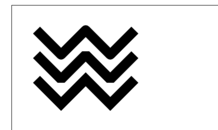

### 虚线

用 `setLineDash` 方法和 `lineDashOffset` 属性来制定虚线样式. `setLineDash` 方法接受一个数组，来指定线段与间隙的交替；`lineDashOffset`属性设置起始偏移量.

```js
function draw() {
	var canvas = document.getElementById('tutorial')
	if (!canvas.getContext) return
	var ctx = canvas.getContext('2d')

	ctx.setLineDash([20, 5]) // [实线长度, 间隙长度]
	ctx.lineDashOffset = -0
	ctx.strokeRect(50, 50, 210, 210)
}
draw()
```

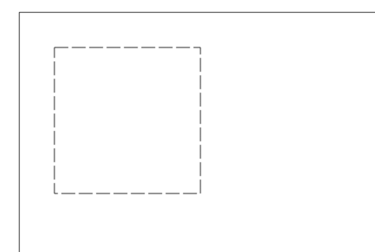

## 6. 绘制文本

canvas 提供了两种方法来渲染文本:

1. fillText(text, x, y [, maxWidth])

在指定的(x,y)位置填充指定的文本，绘制的最大宽度是可选的.

2. strokeText(text, x, y [, maxWidth])

在指定的(x,y)位置绘制文本边框，绘制的最大宽度是可选的.

```js
// 文字配置
function drawText() {
	context.beginPath()
	// 文字 x 轴位置
	context.textAlign = 'center'
	// 文字 y 轴位置
	context.textBaseline = 'middle'
	// 字体大小/样式
	context.font = '100px 微软雅黑'
	// 设置线性渐变 参数: 开始的 x y 坐标, 结束的 x y 坐标
	const gradient = context.createLinearGradient(0, 0, 600, 0)
	gradient.addColorStop(0, '#000')
	gradient.addColorStop(0.5, 'orange')
	gradient.addColorStop(1, '#f00')
	// 应用渐变色
	context.strokeStyle = gradient
	context.fillStyle = gradient

	// 绘制实体文本,参数分别是: 文本内容,文本坐标,最大宽度(超出会挤压)
	context.fillText('hello world!', 300, 200, 600)
	context.strokeText('你好 世界!', 300, 400, 600)
}
drawText()
```

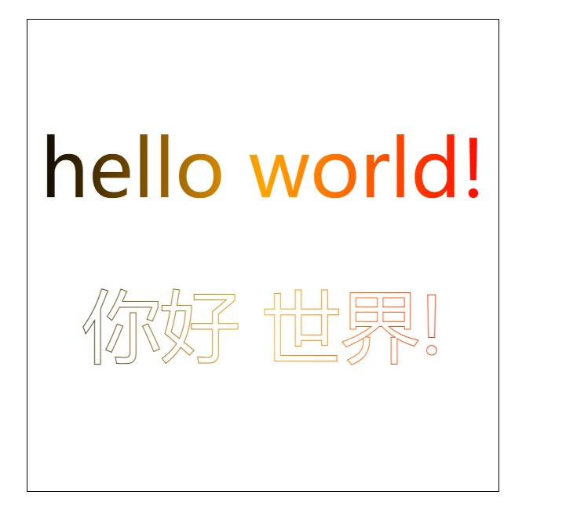

### 文本添加样式

`font = value`

当前我们用来绘制文本的样式。这个字符串使用和 CSS font 属性相同的语法. 默认的字体是 10px sans-serif。

`textAlign = value`

文本对齐选项. 可选的值包括：start, end, left, right or center. 默认值是 start。

`textBaseline = value`

基线对齐选项，可选的值包括：top, hanging, middle, alphabetic, ideographic, bottom。默认值是 alphabetic。

`direction = value`

文本方向。可能的值包括：ltr, rtl, inherit。默认值是 inherit。

## 7. 绘制图片

### 7.1 直接创建图片

```js
// 配置图片
function drawImg() {
	const img = new Image() // 创建一个元素
	img.src = '02-田园小清新.jpg' // 设置图片源地址
	// 图片加载成功后绘制
	img.onload = () => {
		// 显示图片参数:图像实例 / 图像位置 ,会按照图片原尺寸展示
		context.drawImage(img, 0, 0)
	}
}
drawImg()
```

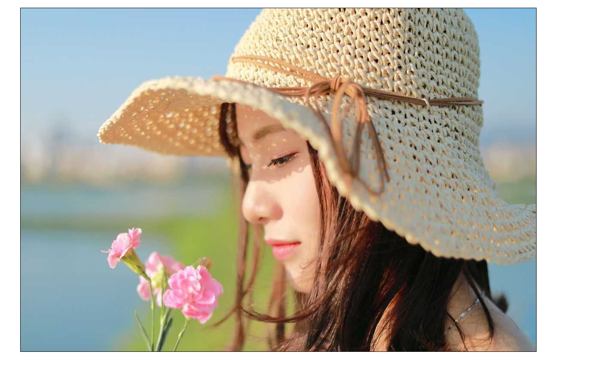

### 7.2 绘制 `img` 标签图片

`img` 可以 `new` 也可以来源于我们页面的 ``标签

```html
<br />
<canvas id="tutorial" width="600" height="400"></canvas>
<script type="text/javascript">
	function draw() {
		var canvas = document.getElementById('tutorial')
		if (!canvas.getContext) return
		var ctx = canvas.getContext('2d')
		var img = document.querySelector('img')
		ctx.drawImage(img, 0, 0)
	}
	document.querySelector('img').onclick = function () {
		draw()
	}
</script>
```

### 7.3 缩放图片

`drawImage()` 也可以再添加两个参数：

`drawImage(image, x, y, width, height)`

这个方法多了 2 个参数：`width` 和 `height，`这两个参数用来控制 canvas 画入时应该缩放的大小

```js
// 配置图片
function drawImg() {
	const img = new Image() // 创建一个元素
	img.src = '02-田园小清新.jpg' // 设置图片源地址
	// 图片加载成功后绘制
	img.onload = () => {
		// 显示图片参数:图像实例 / 图像位置 / 图像宽高
		context.drawImage(img, 0, 0, 320, 240)
	}
}
drawImg()
```

### 7.4 切片(`slice`)

`drawImage(image, sx, sy, sWidth, sHeight, dx, dy, dWidth, dHeight)`

第一个参数和其它的是相同的，都是一个图像或者另一个 canvas 的引用。

其他参数：前 4 个是定义图像源的切片位置和大小，后 4 个则是定义切片的目标显示位置和大小。

```js
// 配置图片
function drawImg() {
	const img = new Image() // 创建一个元素
	img.src = '02-田园小清新.jpg' // 设置图片源地址
	// 图片加载成功后绘制
	img.onload = () => {
		// 裁剪图片参数: 图像实例 /  前4个是定义图像源的切片位置和大小 / ​ 后4个则是定义切片的目标显示位置和大小
		context.drawImage(img, 180, 500, 320, 240, 200, 200, 320, 240)
	}
}
drawImg()
```

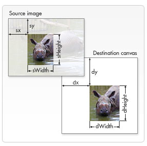

这是裁剪后的图片效果

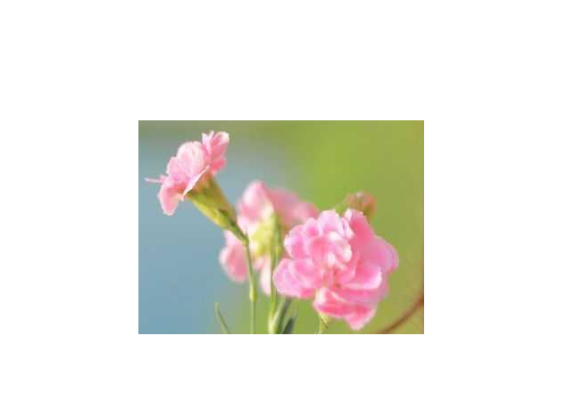

## 8. 状态的保存和恢复

`Saving and restoring state ` 是绘制复杂图形时必不可少的操作。

`save` 和 `restore `方法是用来保存和恢复 canvas 状态的，都没有参数。

Canvas 的状态就是当前画面应用的所有样式和变形的一个快照。

1. 关于 save()

   Canvas 状态存储在栈中，每当 save() 方法被调用后，当前的状态就被推送到栈中保存。一个绘画状态包括：

- 当前应用的变形（即移动，旋转和缩放）

- strokeStyle, fillStyle, globalAlpha, lineWidth, lineCap, lineJoin, miterLimit, shadowOffsetX, shadowOffsetY, shadowBlur, shadowColor, globalCompositeOperation 的值

- 当前的裁切路径（clipping path）

可以调用任意多次 save 方法。(类似数组的 push())

2. 关于 restore()

   每一次调用 restore 方法，上一个保存的状态就从栈中弹出，所有设定都恢复。(类似数组的 pop())

```js
// 存储/读取 canvas 状态,都没有参数。
function save() {
	context.fillRect(100, 100, 200, 200)
	context.save()

	context.fillStyle = 'red'
	context.fillRect(10, 10, 100, 100)
	// 存储 canvas 状态,没有参数。
	context.save()

	context.fillStyle = 'gold'
	context.fillRect(300, 300, 50, 50)
	// context.save()

	// 恢复(获取) canvas 状态,没有参数。
	context.restore()
	context.fillRect(400, 300, 50, 50)

	context.restore()
	context.fillRect(500, 400, 50, 50)
}
save()
```

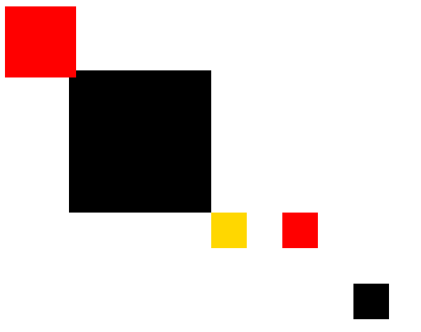

## 9. 变形

### 9.1 translate

`translate(x, y)`

用来移动 canvas 的原点到指定的位置

`translate` 方法接受两个参数。x 是左右偏移量，y 是上下偏移量，如右图所示。

在做变形之前先保存状态是一个良好的习惯。大多数情况下，调用 restore 方法比手动恢复原先的状态要简单得多。又如果你是在一个循环中做位移但没有保存和恢复 canvas 的状态，很可能到最后会发现怎么有些东西不见了，那是因为它很可能已经超出 canvas 范围以外了。

**注意**：translate 移动的是 canvas 的坐标原点。(坐标变换)

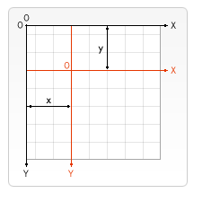

```js
// 设置画布原点 translate 方法,可通过 save 方法先保存原有画布原点, 再来移动原点,后续可通过 restore 方法恢复原点
function drawTranslate() {
	context.save()
	context.translate(300, 300)

	context.fillStyle = 'red'
	context.fillRect(0, 0, 100, 100)

	context.restore()
	context.fillStyle = 'gold'
	context.fillRect(0, 0, 100, 100)
}
drawTranslate()
```

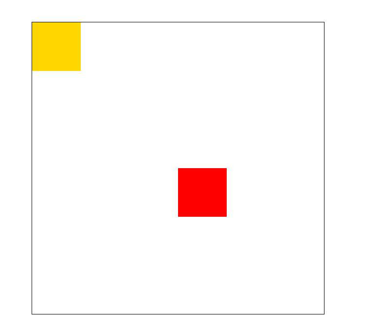

### 9.2 rotate

旋转坐标轴。这个方法只接受一个参数：旋转的角度( angle )，它是顺时针方向的，以弧度为单位的值。 旋转的中心是坐标原点。

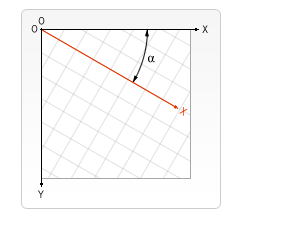

```js
function drawRotate() {
	context.beginPath()
	context.moveTo(300, 0)
	context.lineTo(300, 600)
	context.stroke()
	context.beginPath()
	context.moveTo(0, 300)
	context.lineTo(600, 300)
	context.stroke()
	context.save()
	// 移动原点到中间
	context.translate(300, 300)
	// 旋转坐标轴
	context.rotate(Math.PI)
	context.fillStyle = 'red'
	context.fillRect(0, 0, 30, 30)
	// 恢复原有原点及坐标轴
	context.restore()
	context.fillStyle = 'gold'
	context.fillRect(0, 0, 30, 30)
}
drawRotate()
```

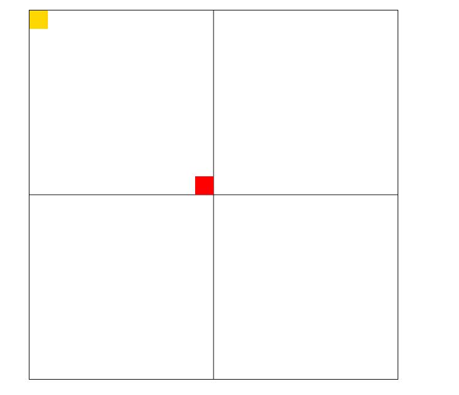

### 9.3 scale

`scale(x, y)`。用它来增减图形在 canvas 中的像素数目，对形状，位图进行缩小或者放大。

scale 方法接受两个参数。x,y 分别是横轴和纵轴的缩放因子，它们都必须是正值。值比 1.0 小表示缩小，比 1.0 大则表示放大，值为 1.0 时什么效果都没有。

```js
// 缩放画布 scale, 1 为原始尺寸, 0-1 之间为缩小, 大于1 为放大
function drawScale() {
	context.save()
	context.fillStyle = 'red'
	// 缩放 0.5 倍,所有均缩放,包括坐标轴定位
	context.scale(0.5, 0.5)
	context.fillRect(0, 0, 100, 100)
	// 原始尺寸
	context.restore()
	context.fillRect(100, 0, 100, 100)
	// 放大 2 倍
	context.restore()
	context.scale(2, 2)
	context.fillStyle = 'gold'
	context.fillRect(150, 0, 100, 100)
}
drawScale()
```

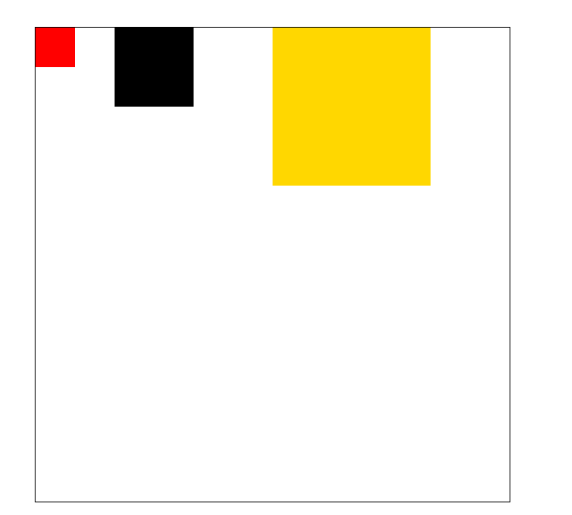

## 10. 动画

1. 清空 canvas

再绘制每一帧动画之前，需要清空所有。清空所有最简单的做法就是 clearRect() 方法

2. 保存 canvas 状态

如果在绘制的过程中会更改 canvas 的状态(颜色、移动了坐标原点等),又在绘制每一帧时都是原始状态的话，则最好保存下 canvas 的状态

3. 绘制动画图形

这一步才是真正的绘制动画帧

4. 恢复 canvas 状态

如果你前面保存了 canvas 状态，则应该在绘制完成一帧之后恢复 canvas 状态。

### 控制动画

我们可用通过 canvas 的方法或者自定义的方法把图像会知道到 canvas 上。正常情况，我们能看到绘制的结果是在脚本执行结束之后。例如，我们不可能在一个 for 循环内部完成动画。

也就是，为了执行动画，我们需要一些可以定时执行重绘的方法。

一般用到下面三个方法：

- setInterval()
- setTimeout()
- requestAnimationFrame()

#### 案例 1：太阳系

```js
// 太阳系循环
function drawSunSystem() {
	// 画圆函数
	function drawCircle(x, y, r, c, isFill) {
		context.beginPath()
		isFill ? (context.fillStyle = c) : (context.strokeStyle = c)
		context.arc(x, y, r, 0, Math.PI * 2, false)
		isFill ? context.fill() : context.stroke()
	}
	// 清除画布
	context.clearRect(0, 0, 600, 600)

	context.fillStyle = '#000'
	context.fillRect(0, 0, 600, 600)
	// 太阳及光芒
	drawCircle(300, 300, 50, 'gold', true)
	drawCircle(300, 300, 100, 'rgba(181,181,181,0.1)', true)
	// 保存状态
	context.save()

	// 地球轨道
	context.translate(300, 300)
	drawCircle(0, 0, 200, 'green', false)

	let time = new Date()
	// 地球
	context.rotate((time.getSeconds() + time.getMilliseconds() / 1000) / 10)
	context.translate(200, 0)
	drawCircle(0, 0, 25, 'rgb(82 129 233)', true)

	// 月球轨道
	drawCircle(0, 0, 60, 'green', false)

	// // 月球
	context.rotate((time.getSeconds() + time.getMilliseconds() / 1000) * 5)
	drawCircle(60, 0, 10, 'rgb(82 129 233)', true)
	// 恢复开始状态
	context.restore()
	// 循环动画
	requestAnimationFrame(drawSunSystem)
}
drawSunSystem()
```

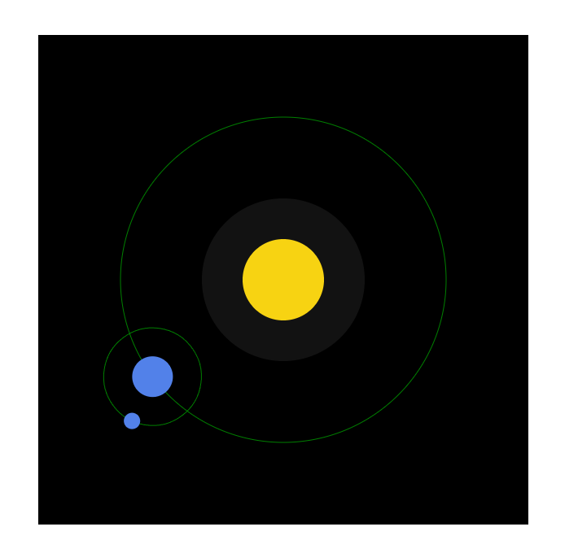

#### 案例 2：时钟走动

```js
// 时钟转动
function drawClock() {
	function drawLine(x1, y1, x2, y2, w, c = '#000') {
		context.beginPath()
		context.moveTo(x1, y1)
		context.lineTo(x2, y2)
		context.strokeStyle = c
		context.lineWidth = w
		context.stroke()
	}
	function drawCircle(x, y, r, c = 'red') {
		context.beginPath()
		context.fillStyle = c
		context.arc(x, y, r, -Math.PI / 2, (Math.PI / 2) * 3, false)
		context.fill()
	}
	function drawText(t, x, y, s = '20') {
		context.font = `${s}px 微软雅黑`
		context.textAlign = 'center'
		context.textBaseline = 'middle'
		context.fillText(t, x, y, 200)
	}
	// 外框
	context.fillStyle = '#ccc'
	context.fillRect(150, 150, 300, 300)
	context.save()
	// 时钟内容
	context.translate(300, 300)
	drawCircle(0, 0, 140, '#fff')
	drawCircle(0, 0, 5, '#000')

	// 刻度
	// 设置 x 坐标：当前 x 坐标 * Math.cos(Math.PI * 2 / 60 * i - Math.PI / 2)
	// 设置 y 坐标：当前 y 坐标 * Math.sin(Math.PI * 2 / 60 * i - Math.PI / 2)
	for (let i = 1; i <= 60; i++) {
		let d = ((Math.PI * 2) / 60) * i - Math.PI / 2
		const x1 = 140 * Math.cos(d)
		const y1 = 140 * Math.sin(d)
		const x2 = i % 5 === 0 ? 125 * Math.cos(d) : 130 * Math.cos(d)
		const y2 = i % 5 === 0 ? 125 * Math.sin(d) : 130 * Math.sin(d)
		const w = i % 5 === 0 ? 4 : 2
		const c = i % 5 === 0 ? '#f00' : '#ccc'
		drawLine(x1, y1, x2, y2, w, c)
	}

	// 数字
	for (let i = 1; i <= 12; i++) {
		let d = ((Math.PI * 2) / 12) * i - Math.PI / 2
		const x = 105 * Math.cos(d)
		const y = 105 * Math.sin(d)
		drawText(i, x, y)
	}

	// 表针
	context.lineCap = 'round'
	let time = new Date()
	const s = (time.getSeconds() * Math.PI * 2) / 60 - Math.PI / 2
	const m = (time.getMinutes() * Math.PI * 2) / 60 - Math.PI / 2
	const h = (time.getHours() * Math.PI * 2) / 12 - Math.PI / 2
	drawLine(0, 0, 50 * Math.cos(h), 50 * Math.sin(h), 7)
	drawLine(0, 0, 70 * Math.cos(m), 70 * Math.sin(m), 5)
	drawLine(0, 0, 90 * Math.cos(s), 90 * Math.sin(s), 3, 'red')

	context.restore()
	requestAnimationFrame(drawClock)
}
drawClock()
```

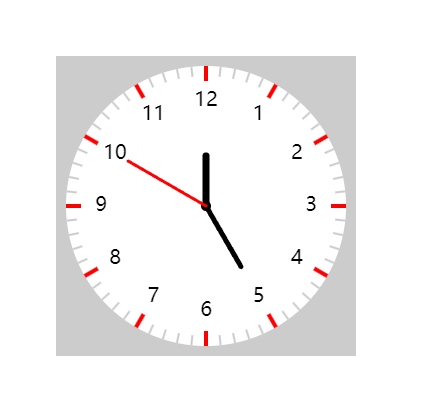

#### 案例 3：移动的小球

```js
// 面向对象移动的小球
function moveCircle() {
	function radom(n) {
		return Math.random() * n
	}
	class Ball {
		constructor() {
			this.x = radom(580) + 60
			this.y = radom(580) + 60
			// this.x = 80
			// this.y = 80
			this.r = radom(50) + 10
			this.c = '#' + parseInt(radom(0xffffff)).toString(16)
			this.xSpeed = radom(5) + 1
			this.ySpeed = radom(5) + 1
		}
		show() {
			context.beginPath()
			context.arc(this.x, this.y, this.r, 0, Math.PI * 2)
			context.fillStyle = this.c
			context.fill()
		}
		run() {
			this.show()
			if (this.x + this.r >= w || this.x - this.r <= 0) {
				this.xSpeed = -this.xSpeed
			}
			this.x += this.xSpeed
			if (this.y + this.r >= h || this.y - this.r <= 0) {
				this.ySpeed = -this.ySpeed
			}
			this.y += this.ySpeed
		}
	}
	let w = 700
	let h = 700
	let arr = []
	// 循环添加生成的小球实例对象
	for (let i = 0; i < 100; i++) {
		arr.push(new Ball())
	}
	setInterval(() => {
		// 清除画布, 循环数组调用 run 方法
		context.clearRect(0, 0, w, h)
		arr.forEach((item) => {
			item.run()
		})
	}, 10)
}
moveCircle()
```

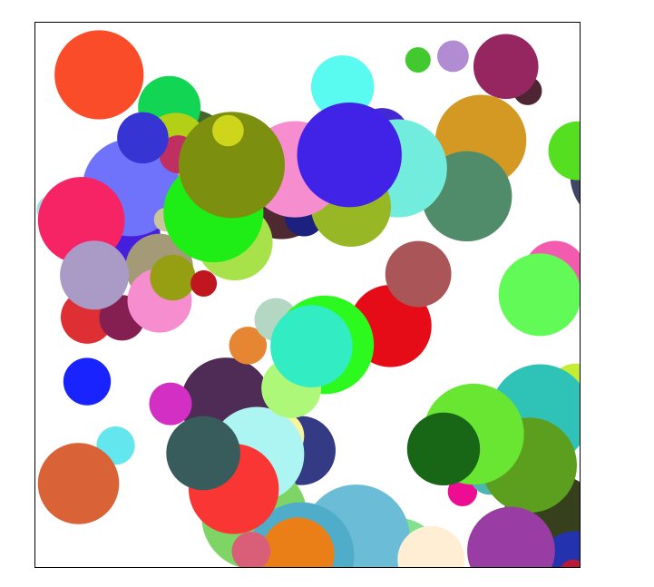

#### 案例 4：线性移动小球

```js
// 线性小球
function drawLineCircle() {
	const radom = (n) => Math.random() * n
	function drawCircle(x, y, r, c = 'red') {
		context.beginPath()
		context.fillStyle = c
		context.arc(x, y, r, 0, Math.PI * 2)
		context.fill()
	}
	function drawLine(x1, y1, x2, y2, c = 'orange', w = 1) {
		context.beginPath()
		context.moveTo(x1, y1)
		context.lineTo(x2, y2)
		context.strokeStyle = c
		context.lineWidth = w
		context.stroke()
	}
	function drawText(x, y, t = 'hello', c = 'green', f = '20', w = 100) {
		context.beginPath()
		context.textAlign = 'left'
		context.textBaseline = 'middle'
		f = f < 15 ? 15 : f
		context.font = `${f}px sans-serif`
		context.fillStyle = c
		context.fillText(t, x, y, w)
	}
	class DrawLineCircle {
		constructor() {
			this.x = radom(480) + 60
			this.y = radom(480) + 60
			this.r = radom(50) + 10
			// this.c = '#' + parseInt(radom(0xffffff)).toString(16)
			this.c = `rgb(${radom(255)},${radom(255)},${radom(255)})`
			this.xSpeed = radom(5) + 1
			this.ySpeed = radom(5) + 1
		}
		show(t) {
			drawCircle(this.x, this.y, this.r, this.c)
			drawText(this.x + this.r, this.y - this.r, t, this.c, this.r / 2)
		}
		move(t) {
			this.show(t)
			if (this.x + this.r >= w || this.x - this.r <= 0) {
				this.xSpeed = -this.xSpeed
			}
			this.x += this.xSpeed
			if (this.y + this.r >= h || this.y - this.r <= 0) {
				this.ySpeed = -this.ySpeed
			}
			this.y += this.ySpeed
		}
	}
	const w = document.documentElement.clientWidth - 6
	const h = document.documentElement.clientHeight - 6
	canvas.width = w
	canvas.height = h
	let arr = []
	let textArr = ['javascript', 'html', 'css', 'jquery', 'vue', 'react', 'ajax', 'echars', 'wechat', 'git', 'more']
	for (let i = 0; i < 5; i++) {
		const ball = new DrawLineCircle()
		arr.push(ball)
	}
	setInterval(() => {
		context.clearRect(0, 0, w, h)
		arr.forEach((it, i) => {
			// 找到每个小球的前一个，将结束位置设置为前一个小球的位置
			for (let j = 0; j < i; j++) {
				const prev = arr[j]
				const now = arr[i]
				drawLine(now.x, now.y, prev.x, prev.y, now.c, now.r / 10)
			}
			it.move(textArr[i])
		})
	}, 10)
}
drawLineCircle()
```

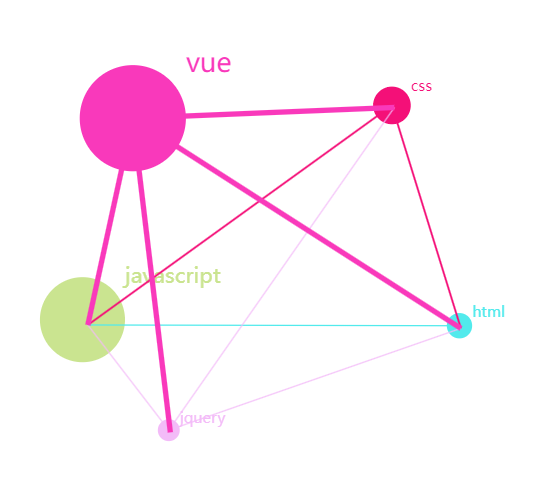
