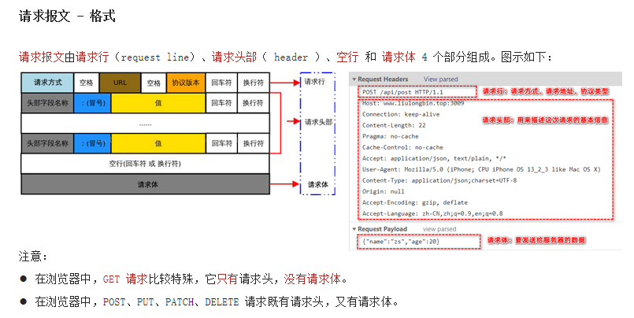
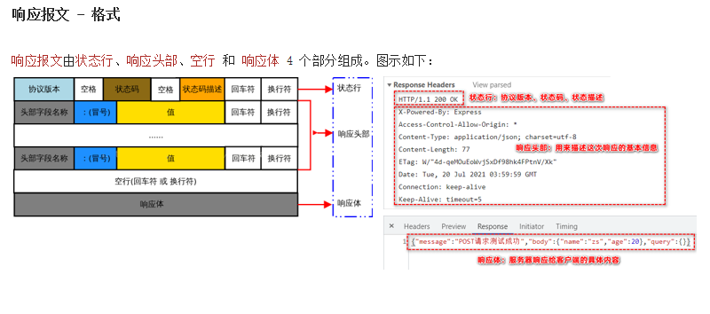

# ajax 总结


### 1. 概念

- Ajax 是浏览器中的技术：用来实现客户端网页请求服务器的数据。它的英文全称是 Asynchronous Javascript And XML，简称 Ajax


### 2. Ajax 五种请求方法

- get : 向服务器获取数据( 参数用 params 表示)
- post : 向服务器新增数据 ( 参数用 data 表示)
- delete :  删除服务器上的数据
- put : 更新服务器的数据 ( 侧重于完整更新 )
- patch : 更新服务器数据 ( 侧重于部分更新 )


### 3. URL地址

一个完整的url地址分为:  协议、域名(IP地址)、端口、资源存放路径。

- 协议：协议是用来规范网络通讯中数据的格式。常见: http 和 https
- 域名：电脑主机网络中存放的位置，主机地址的唯一标识。域名就是 给 IP 地址起个名字，方便记忆。
- 端口：电脑与外界通讯交流的出口，为数字类型，取值范围 0~65535 之间。其中80为http专用。
- 资源存放路径：资源存放路径就是资源在服务器中的具体存放地址


### 4. URL编码

- 在 URL 地址中不允许出现中文、空格等特殊字符，因此浏览器会自动对 URL 地址内的中文进行转换处
- 浏览器内置了 encodeURIComponent() 和 decodeURIComponent() 两个方法，用来实现 URL 的编码和解码处理：

```js
encodeURIComponent('中国')  // '%E4%B8%AD%E5%9B%BD'
decodeURIComponent('%E4%B8%AD%E5%9B%BD')  // '中国'
```


### 5. 请求报文和响应报文

客户端与服务器通信的过程是基于请求与响应的。其中：

- 请求报文规定了客户端以什么格式把数据发送给服务器
- 请求报文由请求行,请求头,空行和请求体四个部分组成
- 响应报文规定了服务器以什么格式把数据响应给客户端
- 响应报文由状态行,响应头,空行和响应体组成





### 6. axios拦截器

拦截器（interceptors）用来全局拦截 axios 的每一次请求与响应。

好处：可以把每个请求中，某些重复性的业务代码封装到拦截器中，提高代码的复用性。

```
// 添加请求拦截器
axios.interceptors.request.use(function (config) {
    // 在发送请求之前做些什么
    return config;
}, function (error) {
    // 对请求错误做些什么
    return Promise.reject(error);
});

// 添加响应拦截器
axios.interceptors.response.use(function (response) {
    // 对响应数据做点什么
    return response;
}, function (error) {
    // 对响应错误做点什么
    return Promise.reject(error);
});
```


### 7. 文件上传 FormData

​    概念：FormData 是浏览器提供的一个 WebAPI，它以键值对的方式存储数据。
​	作用：FormData 配合 Ajax 技术，能够向服务器发送 multipart/form-data 格式的请求体数据。
​	场景：FormData + Ajax 技术实现文件上传的功能。
​	注意：Ajax 实现文件上传的时候，请求体的编码格式必须是 multipart/form-data。

- FormData 是一个构造函数，new FormData() 即可得到 FormData 对象
- 调用 FormData 对象的 append(键, 值) 方法，可以向空白的 FormData 中追加键值对数据


### 8. 数据交换格式 JSON

-   JSON（全称：JavaScript Object Notation）是一种数据交换格式，它本质上是用字符串的方式来表示对象或数  组类型的数据。
- 把真实数据转换为字符串的过程，叫做序列化，把字符串转换为真实数据的过程，叫做反序列化。

```js
 JSON.parse()  // json 转字符串
 JSON.stringify() // 字符串转 json
 // 不能使用 undefined 和函数作为 json 的值, 如使用不会被转换会直接过滤掉
```


### 9. 防抖和节流

- 防抖,指的是间隔时间内频繁执行某操作,只会执行最后一次,当事件被触发时,延迟一段时间后再执行回调,如果在这段时间内事件又被触发,则重新计时
  - 减少逻辑执行的次数,可以有效减少请求,节省网络资源
  - 常见的场景如搜索框,页面适配等

- 节流,指的是一段时间内多次触发某操作,只会执行一次,在规定时间内多次执行无效,必须等上一次回调执行完毕后再来执行下一次回调
  - 减少逻辑执行的次数,可以有效减少请求,节省网络资源
  - 常见使用场景如页面新闻刷新, 游戏技能的释放